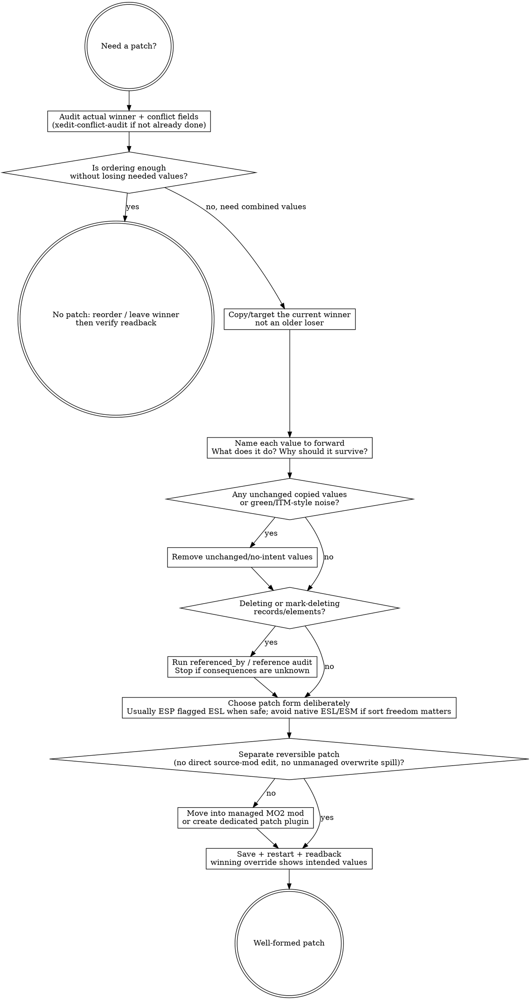

# xEdit Automation — Hub Skill

This skill is the always-loaded entry point for any xEdit work. It is the single source of truth for "which path do I use" and "what must I never do." Specialised task skills (e.g. `xedit-conflict-audit`) inherit its routing, anti-patterns, and verification discipline; they do not restate them.

## Toolbox at a glance (progressive disclosure, r6-aware)

The forked xEdit daemon is best treated as a progressive-disclosure surface:
start with the small MCP intent tools, ask the live daemon which r6 capability
blocks it supports, then switch to the richer one-call patterns only when the
corresponding `system.capabilities.supports.*` key is present.

- **Discovery & session** — `xedit_session`, `xedit_list_capabilities`. Call
  `xedit_session` first every conversation. Then call `xedit_list_capabilities`
  once to see the command digest, `contractVersionExpected`, and r6
  `supports.*` anchors.
- **Reading records & conflicts** — `xedit_find_record`, `xedit_read_record`,
  `xedit_inspect_conflicts`. These are the W2 (conflict audit) backbone; branch
  to atomic passthrough when W2 needs an r6 response block that no intent tool
  exposes yet.
- **Atomic passthrough** — `xedit_call(command, args)`. For any native daemon
  command that does not have an intent tool yet. Still runs the full pipeline
  (validation → state → rules → audit). Use it whenever the intent tools do not
  fit.

For deep reference material, query the structured BGS KB first (`bgs_kb_query`
/ `bgs_kb_get`). Deep reference records live under
`knowledge/bgs-kb/packs/core/records/xedit/` (queryable via `bgs_kb_query` /
`bgs_kb_get`).

## Routing doctrine (which path to use)

| Task shape | Path |
|---|---|
| High-frequency known intent (audit a conflict, read a record, run a job, write a patch) | **MCP intent tool** |
| Novel / debugging / free composition of native commands | **MCP atomic passthrough**: `xedit_call(command, args)` — still in harness |
| Exploratory atomic-op storm (trial-and-error, repeated read-eval, hypothesis testing) | **Delegate to a read-only investigator sub-agent** with this skill loaded; the sub-agent burns its own context, returns a distilled summary |
| Large formalisable bulk mutation | **MCP `xedit_run_script`** (Batch 4+) with dry-run + snapshot |
| Daemon explicitly in default (non-MCP) mode, manual debug only | Direct `xedit-client.ps1` is acceptable — but ONLY when the user has explicitly accepted the risk and the daemon is not in `-automation-mcp-mode` |

**The agent should never have a reason to bypass the MCP.** Atomic passthrough exists for that.

## 补丁创作判断 / Patch authoring judgment

### Overview

Patch authoring is not "make the red go away." It is a small compatibility
argument: preserve the current winner, forward only the upstream values that
should still survive, and leave behind a reversible patch plugin whose contents
say what you meant. Sorting is a single-choice lever; patching is how you keep
two mods' intended values active at once. But true-in-principle is not
true-at-pack-scale: if the plan is to stitch every FormID because "xEdit can fix
anything," the plan is already broken.

Use this section when you are about to author or judge a patch through the MCP.
Use `xedit-conflict-audit` first when the question is still "what wins, what
conflicts, and should this be patch-vs-reorder?" That skill owns the
patch-vs-reorder call; this section owns whether the patch you are about to
write is well-formed.

### Decision flow: is this patch well-formed?



### Authoring checks

- **Forward the winner.** The game reads the final/winning override for a
  FormID. Build the patch from the current winner, then forward only the older
  mod values that still need to survive.
- **No unchanged cargo.** If a copied value does not change meaning, it is
  ITM-style noise, not compatibility. Remove it unless you can state why it is
  intentionally carried.
- **Patch as separate layer.** Do not drag values directly into the source mod
  just because it is the rightmost column today. A patch should be reversible by
  disabling/removing the patch layer, not by hand-deleting fields from someone
  else's plugin.
- **Preserve references.** If deletion or mark-delete enters the plan, stop and
  run the referenced-by/readback path first. Unknown references mean unknown
  blast radius.
- **Choose plugin form deliberately.** Ordinary compatibility patches usually
  want normal ESP sort freedom plus ESL flagging when safe. Native ESL/ESM
  load-order behavior is not a free cleanliness upgrade.
- **Good patch vs band-aid patch.** A good patch has named intent per forwarded
  value and reduces conflict debt. A band-aid patch copies whole records, edits
  source mods, or tries to stitch every FormID because sorting was treated as
  irrelevant.

### KB query discipline

This judgment section is game-agnostic. Query KB for game-specific patching
gotchas, record-family caveats, and current toolchain facts rather than
fossilizing them here.

```text
bgs_kb_query({ query: "xedit patch authoring gotchas", domains: ["xedit", "load-order"], games: ["<current game>"] })
```

If KB is silent, mark `[GAP]` and keep the patching rule at the framework level
instead of inventing a game-specific doctrine.

### Red Flags (STOP)

| Thought | Reality |
|---|---|
| "It's red, so copy the left value." | Red is a prompt to inspect. It is not a verdict that the losing value should survive. |
| "The rightmost mod is wrong; I'll edit it directly." | Then you made the source mod the patch. Use a separate override patch so reversal is clean. |
| "Sorting does not matter because xEdit can patch anything." | In principle, yes; across hundreds of thousands of FormIDs, no. Use ordering to reduce repair debt, then patch the meaningful remainder. |
| "Green/unchanged copied values are harmless." | They are no-intent cargo. If they do not change meaning, remove them. |
| "Native ESL is cleaner than ESP flagged ESL." | Native ESL/ESM can cost normal sort freedom. Use ESP flagged ESL when that is the safe patch shape. |
| "This looks unused; delete it." | Referenced-by first. Deletion without reference knowledge is unknown blast radius. |

### Rationalizations

| Excuse | Reality |
|---|---|
| "I'll just drag one field into the winning plugin." | One field is still a source-mod edit. Make a patch layer, or future-you hand-removes stray fields one by one. |
| "The patch should preserve everything any mod touched." | Preserve intent, not history. Some edits are core to the mod; some are incidental author preference that should lose to a systemic rule. |
| "I do not know what this field does, so I'll copy the version that looks plausible." | Unknown field meaning is a research task, not a dice roll. Read the record structure, CK/wiki/community examples, and actual in-pack behavior. |
| "Overwrite is fine; MO2 sees it." | Overwrite is spill. A real patch belongs in a managed mod layer with a name future-you can understand. |
| "The response said ok; the patch is done." | Patch acceptance is winning-override readback after save/restart, with the intended values visible and no unintended cargo. |

## R6 progressive-disclosure capability checks

Do not assume every daemon is r6. Read `xedit_list_capabilities` once and branch
on the support keys below. On pre-r6 daemons, fall back to the older explicit
record-list / child-walk / per-record loop patterns; on r6+ daemons, use the
one-call or page-aware form to reduce round-trips and preserve context.

| Capability key | Contract | Prefer this pattern | KB record |
|---|---:|---|---|
| `supports.childGroupNavigation` | 0.13 | Navigate CELL/WRLD/DIAL/QUST ChildGroups through `elements.children` stubs | `xedit.childgroup-navigation.v1` |
| `supports.createParentSpec` | 0.16 / 0.18 | Create records directly under parent ChildGroups with `records.create` `parent` | `xedit.records-create-parent-spec.v1` |
| `supports.elementsChildrenPagination` | 0.17 | Page `elements.children` with `limit` / `offset` | `xedit.elements-children-pagination.v1` |
| `supports.reverseNavigation` | 0.19 | Add `includeParents:true` and read `relations.parents` | `xedit.reverse-navigation.v1` |

For the whole r6 contract delta, query KB record `xedit.r6-contract-summary.v1`.

### ChildGroup navigation (`supports.childGroupNavigation`)

On r6+ daemons, `elements.children` on CELL, WRLD, DIAL, and QUST records
returns a virtual child entry with `kind: "child_group"`. Treat that entry as a
read-only navigation stub, not as a real mutable element.

Use it one generation at a time:

```text
elements.children({ file, formId, path: "\\Child Group" })
elements.children({ file, formId, path: "\\Child Group\\Persistent" })
elements.children({ file, formId, path: "\\Child Group\\Temporary" })
elements.children({ file, formId, path: "\\Child Group\\Visible when Distant" })
elements.children({ file, formId, path: "\\Child Group\\Block X, Y" })
elements.children({ file, formId, path: "\\Child Group\\Block X, Y\\Sub-Block M, N" })
```

- Walk exactly the next level; do not ask for the whole tree when a page or one
  ChildGroup label is enough.
- The `\\Child Group...` paths are synthetic and READ-ONLY. Mutation verbs must
  use flat FormID locators (`{ file, formId }`) or a `records.create.parent`
  spec; do not pass synthetic locator paths to mutators.
- For WRLD cells, use `Persistent` or the Block/Sub-Block/coordinate route
  depending on the target child group.
- Deep reference: `xedit.childgroup-navigation.v1`.

### `elements.children` pagination (`supports.elementsChildrenPagination`)

On r6+ daemons, `elements.children` accepts `limit` and `offset`:

```text
elements.children({ file, formId, path, limit: 200, offset: 0 })
```

- `limit` is clamped to 1-1000 and defaults to 200.
- Responses include `count`, `total`, `offset`, and `truncated`.
- If `truncated` is true, keep the same `limit`, add `count` to `offset`, and
  fetch the next page until covered.
- Do not assume CELL child groups are small: FO4 vanilla CELL `00000025`
  `Temporary` contains 742 records.
- Deep reference: `xedit.elements-children-pagination.v1`.

### Reverse navigation (`supports.reverseNavigation`)

On r6+ daemons, add `includeParents: true` when you need to know ownership or
containment without a second verb. Supported read calls include:

- `records.get`
- `records.find_by_form_id` / `records.find_by_editor_id` and MCP wrappers such
  as `xedit_find_record`
- `records.master_or_self`
- `records.winning_override`
- `elements.get`
- `elements.children`

The response may include:

```text
relations.parents: [{ locator, object }, ...]
```

Parents are nearest-first with a daemon depth cap of 16. This is the preferred
answer to "which CELL owns this REFR?" or "which QUST/DIAL group contains this
child?" Use the parent chain as readback evidence; do not build a custom
reverse-index loop unless the support key is absent. Deep reference:
`xedit.reverse-navigation.v1`.

### `records.create` parent-spec (`supports.createParentSpec`)

Mutating record creation into ChildGroups is r6-gated and still requires the
normal MCP mutation consent path. When supported, author the target parent
explicitly instead of trying to mutate synthetic `\\Child Group` paths.

CELL, DIAL, and QUST children:

```text
records.create({
  targetFile,
  signature,
  editorId,
  parent: { file, formId, subGroup? }
})
```

WRLD children:

```text
records.create({
  targetFile,
  signature,
  editorId,
  parent: { file, formId, subGroup: "Persistent" }
})

records.create({
  targetFile,
  signature,
  editorId,
  parent: { file, formId, coords: [X, Y] }
})
```

For `coords`, native xEdit creates the needed Block/Sub-Block groups. Validate
with `records.get` or `elements.children({ includeParents: true })` after the
preview/commit flow, and remember that durability still requires save + daemon
restart + readback. Deep reference: `xedit.records-create-parent-spec.v1`.

## Anti-patterns (hard bans)

Never do any of the following. Each ban is encoded as an MCP rule or daemon-side refusal, but the skill states them so the agent does not even attempt:

1. **Do not write Python (or any other language) to parse `.esp/.esm/.esl` files directly.** The daemon is the only correct path. If you find yourself reaching for a binary plugin parser, stop and use `xedit_call` instead.
2. **Do not trust an `ok: true` response as durability.** A save with `pendingShutdown > 0` is deferred; durability requires a daemon restart and readback (see §10 of the design spec).
3. **Do not call mutating ops in mcp-mode without going through the MCP.** Direct pipe writes will be refused by the daemon with `mcp_mode_required`.
4. **Do not page `system.capabilities` every session.** The digest in `xedit_list_capabilities` already carries the curated map; only call live capabilities once to check drift.
5. **Do not delete or mark-deleted a record that is referenced by other plugins** without first calling `xedit_call records.referenced_by` and accepting the consequences. Snapshot does not cleanly recover deletions.

## Enabling consent (`-IKnowWhatImDoing`)

Mutating intent tools (`xedit_create_child_record`, `xedit_call records.create`,
`xedit_call records.delete`, `xedit_call records.copy_into`, etc.) require the
xEdit daemon to be launched in consent mode — otherwise they fast-fail with
`code: "mutation_requires_iknowwhatimdoing"` BEFORE the daemon is contacted.

Enable consent at launch time via the MCP arg:

```
xedit_start({ iKnowWhatImDoing: true, ...other overrides })
xedit_restart({ iKnowWhatImDoing: true, ...other overrides })  # if already running
```

The flag is forwarded as `--i-know-what-im-doing 1` to `xedit-client.ps1`, which
appends `-IKnowWhatImDoing` to xEdit's startup argv. Verify post-launch:

```
xedit_session()  # data.consentEnabled === true ?
```

If `consentEnabled` is still `false` after passing `iKnowWhatImDoing: true`,
the flag did not propagate — check that the MCP is on a build that includes
the consent forwarding (commit `xxx` and later; see `RELEASE-NOTES.md`).

Consent is per-launch and explicit only: there is no env-var fallback, no
runtime toggle, and the audit log captures the consent decision at the call
site. To revoke consent, call `xedit_stop` then `xedit_start` without the flag.

## Confidence + dry-run discipline (borrowed from skyrimvr-claude-toolkit)

Before any mutating action:

1. State your confidence (0-100%) and your top 3 assumptions.
2. If confidence < 90%, investigate first (read records, inspect conflicts, list references) until ≥ 90%.
3. For HIGH-RISK mutations, the MCP will return a preview envelope with `confirmToken`. Read the preview, decide, then commit with the token. Treat the preview as the contract.

## Sub-agent delegation recipes (role-agnostic)

When delegating, do not hard-code role names — the harness will map them. Use these recipes:

**Read-only investigator** — for exploratory storms, conflict surveys, and "what's in this plugin" reconnaissance:

> Dispatch a read-only investigator sub-agent with this skill loaded. Provide the question, the target files, and the budget (token / time / step count). The sub-agent should return a distilled summary (verdict + key evidence + open questions), not the raw daemon round-trips.

**Bounded mutation worker** — for well-defined batch edits (Batch 4+):

> Dispatch a bounded-execution sub-agent with this skill and the patch-authoring skill loaded. Provide the spec, the snapshot expectations, and the acceptance checks. The sub-agent should perform the mutations through the MCP and return the snapshot IDs + readback proof.

## Self-growing knowledgebase

After any session that produced a footgun (an unexpected refusal, a non-obvious recovery, a surprising daemon behavior):

1. Identify whether the gotcha is a durable fact, not project-internal noise. Project-local lessons that do not belong in the public KB go in the project devlog instead.
2. Author a KB record at `<pack-root>/records/<domain>/<slug>.v1.md` with YAML frontmatter that validates against `knowledge/bgs-kb/schema/record.schema.json`.
3. Pick the pack deliberately: cross-game / cross-tool facts go under `knowledge/bgs-kb/packs/core/records/`; game-specific facts go into the matching per-game pack (`bgs-kb-skyrim`, `bgs-kb-fallout4`, `bgs-kb-fallout3-fnv`, `bgs-kb-starfield`).
4. Run `node tools/bgs-kb-mcp/dist/cli.js validate <pack-root>` and then `node tools/bgs-kb-mcp/dist/cli.js build <pack-root>` to refresh that pack, unless the current phase explicitly forbids rebuilds and gives a narrower validation path.
5. Verify retrieval from a fresh MCP connection with `bgs_kb_query` and confirm the new record appears for a query a future agent would actually use.
6. If the footgun is mechanically detectable, mark the KB record as a rule candidate when the schema supports it and track the reserved rule ID in a planning doc. Candidates require human review before promotion into `tools/xedit-mcp` enforcement.

Worked example:

1. Gotcha: xEdit daemon responses may include `0x`-prefixed FormIDs, while the MCP normalizes them at the edge.
2. Pack/path: `knowledge/bgs-kb/packs/core/records/xedit/formid-prefix-normalization.v1.md`.
3. Validate/build: `node tools/bgs-kb-mcp/dist/cli.js validate knowledge/bgs-kb/packs/core` then `node tools/bgs-kb-mcp/dist/cli.js build knowledge/bgs-kb/packs/core`.
4. Verify: query `bgs_kb_query({ query: "0x FormID normalization", domains: ["xedit"] })` and confirm the record is returned.

## When this skill applies

- Any task involving Bethesda plugin files (`.esp/.esm/.esl`) for FO4, Skyrim, FO76, Starfield in this repo's MO2 harness.
- Any conflict / patching / cleaning / ESL / scripting task against xEdit.
- Whenever the task description names xEdit, plugin records, FormIDs, masters, conflicts, ITM/UDR, ESL flagging, or Pascal Edit Scripts.

When in doubt, load it.

## Sibling skills

- **`writing-bgs-load-order`** — authoritative reference for editing
  `plugins.txt` / `loadorder.txt`. Use it whenever the task is about
  activating, deactivating, reordering, adding, or removing plugins from the
  load order. Do NOT edit `plugins.txt` blindly; xEdit can not change load
  order itself (docs 2.3), so the file edit is the only path for those
  operations, and the asterisk-format rules + official-master detection rules
  are non-obvious.
- **`setting-up-bgs-modding-environment`** — first-run setup including the
  MO2 `gamePath` inspection step you must do before launching xEdit with the
  `dataPath` override.

## Launching xEdit with explicit args (NEW)

The `xedit_start` MCP tool accepts optional overrides:

```
xedit_start({
  launcherPath?: string,    // xEdit.exe path
  gameMode?: string,        // "Fallout4", "SkyrimSE", etc.
  dataPath?: string,        // -D: flag; MO2 <gamePath>\\Data
  pluginsFile?: string,     // -P: flag; agent-authored plugins.txt
  moProfile?: string,       // MO2 profile name; defaults to env
  starfieldRedPill?: boolean, // Starfield save-unlock trio; defaults true
})
```

**Always pass `dataPath`** when the user wants xEdit to see the MO2-managed
game tree. Without it, xEdit falls back to the Windows registry, which
returns the raw Steam install path — and your conflict audit will be against
the wrong game data. Read MO2's `ModOrganizer.ini` `gamePath` value, append
`\\Data`, and pass that.

For load-order experimentation (test a subset of plugins to isolate a
conflict, or rehearse a sort), generate a plugins.txt under an
**agent-owned artifacts path** per `writing-bgs-load-order` and pass it as
`pluginsFile`.

## Starfield save unlock (RedPill switches)

Symptom: SF1Edit refuses to save Starfield small/medium/localized ESMs with an
error like `Medium flagged files can't be saved in SF1Edit`.

Upstream xEdit 4.1.5k added the required switch trio:
`-ItJustWorksTM -ThisIsFine -GiveMeTheRedPill`. This plugin's launcher passes
all three by **default** for `gameMode: "Starfield"` sessions. Opt out only when
you are intentionally testing vanilla SF1 save gates:

```
xedit_start({ gameMode: "Starfield", starfieldRedPill: false })
```

Side effects when RedPill is on:

- The xEdit window title shows `ItJustWorks[TM] Edition`; this is ceremonial,
  not a bug.
- `files.create` no longer auto-adds `Starfield.esm` as a master. Call
  `files.create({ ..., initialMasters: ["Starfield.esm"] })` or follow with
  `files.add_required_masters` when the new file needs the base master.

## Dirty-state and relaunch control (NEW)

The daemon already exposes `session.get_dirty_state`, and the MCP now
surfaces three helper tools so the agent does not need to remember the raw
daemon verb:

- `xedit_dirty({})` — returns `{ dirty, dirtyFiles, unsavedChangeCount }` when
  ready. This is the safe thing to call before any stop/restart.
- `xedit_stop({ force?: true })` — if the session is dirty and `force` is not
  set, refuses with `code: "dirty_state"` and the list of unsaved files.
- `xedit_restart({ launcherPath?, gameMode?, dataPath?, pluginsFile?, moProfile?, force?: true })`
  — same dirty-state safety as stop, then relaunches asynchronously with new
  overrides.

Use `xedit_restart` whenever you need to reboot xEdit with a different custom
`pluginsFile` or `dataPath`. Do NOT tell the user to reconnect `/mcp` manually
just to clear a zombie or change launch args.
