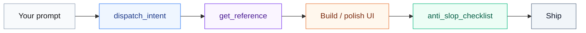

<div align="center">


<br />

**Plug-and-play MCP. UI superpowers for your agent.**

<br />

[](#setup)
[](https://www.npmjs.com/package/designer-skill-mcp)
[](https://www.npmjs.com/package/designer-skill-mcp)
[](LICENSE)

<br />

[](#setup)
[](#reference)
[](#tools)
[](#tools)

<br />

[Overview](#overview) · [Setup](#setup) · [Reference](#reference) · [Tools](#tools) · [Development](#development)

```bash
npm i designer-skill-mcp
```

</div>

<br />

<table width="100%">
<tr>
<td width="33%" valign="top" bgcolor="#ecfdf5">

### Route

`dispatch_intent` maps vague requests like "make it pop" or "it feels off" to the right design verb and reference files.

</td>
<td width="34%" valign="top" bgcolor="#eff6ff">

### Know

15 reference files cover type, color, motion, a11y, anti-slop, and redesign loops. Your agent reads the right file before writing UI code.

</td>
<td width="33%" valign="top" bgcolor="#faf5ff">

### Check

A 44-rule deterministic detector plus `anti_slop_checklist` runs before shipping. Generic UI gets caught before it lands.

</td>
</tr>
</table>

<br />

<div align="center">

[](#overview)

</div>

**designer-skill-mcp** is a small [MCP](https://modelcontextprotocol.io) server you add in one line. Your agent gets design tools, reference docs, and a ship gate so UI work stops looking generic.



Add the server. Ask in plain language. The agent handles the rest.

<div align="center">

[](skills/designer-skill/)
[](designer-skill-mcp/)

**Built with it:** [pythinker.com](https://pythinker.com) — a live production site designed end-to-end with this skill.

<a href="https://pythinker.com"></a>

</div>

<br />

<div align="center">

[](#setup)

</div>

### Plugin (recommended)

<div align="center">

[](#setup)
[](#setup)
[](#setup)

</div>

One install gets both the skill and the MCP server:

```
/plugin marketplace add Pythoughts-labs/designer-skill
/plugin install designer-skill@pythoughts-labs
```

Codex CLI:

```bash
codex plugin marketplace add Pythoughts-labs/designer-skill
```

Then install **designer-skill** from the **pythoughts-labs** marketplace in `/plugins`. The skill appears as `designer-skill:designer-skill`.

**Cursor:** install from the marketplace (or open this repo). Plugin ships `mcp.json`, skills, and `/designer-setup` · `/designer-status` commands.

### Plug in (any client)

Same one-liner everywhere. No API key. Repo-root `mcp.json` is the canonical MCP config (plugins reference it too):

```json
{
  "mcpServers": {
    "designer-skill": {
      "command": "npx",
      "args": ["-y", "designer-skill-mcp@latest"]
    }
  }
}
```

**Updates:** `@latest` for newest npm; pin @0.11.0 for teams. Plugin skill content updates separately (`/plugin update …`). Registry: `io.github.pythoughts-labs/designer-skill-mcp` (publish via `mcp-publisher` after npm release).

<div align="center">

[](docs/blog/integrating-designer-skill-with-pythinker.md)
[](https://github.com/openai/codex)
[](https://claude.ai/code)
[](https://cursor.com)
[](https://code.visualstudio.com)
[](https://kilocode.ai)
[](https://opencode.ai)
[](https://github.com/earendil-works/pi-coding-agent)

</div>

<table>
<thead>
<tr>
<th align="left" bgcolor="#0ea5e9"><font color="#ffffff">Client</font></th>
<th align="left" bgcolor="#0ea5e9"><font color="#ffffff">Quick install</font></th>
</tr>
</thead>
<tbody>
<tr><td bgcolor="#f0f9ff"><b>Pythinker</b></td><td bgcolor="#f8fafc"><code>pythinker mcp add --transport stdio designer-skill -- npx -y designer-skill-mcp</code> · <a href="docs/blog/integrating-designer-skill-with-pythinker.md">guide</a></td></tr>
<tr><td bgcolor="#ecfdf5"><b>Codex CLI</b></td><td bgcolor="#f8fafc"><code>codex mcp add designer-skill -- npx -y designer-skill-mcp</code></td></tr>
<tr><td bgcolor="#faf5ff"><b>Claude Code</b></td><td bgcolor="#f8fafc"><code>claude mcp add designer-skill -- npx -y designer-skill-mcp</code></td></tr>
<tr><td bgcolor="#f1f5f9"><b>Cursor</b></td><td bgcolor="#f8fafc">Cursor plugin or copy <code>mcp.json</code> → <code>.cursor/mcp.json</code></td></tr>
<tr><td bgcolor="#eff6ff"><b>VS Code</b></td><td bgcolor="#f8fafc"><code>.vscode/mcp.json</code> (<code>"servers"</code> + <code>"type": "stdio"</code>)</td></tr>
<tr><td bgcolor="#fdf4ff"><b>Kilo Code</b></td><td bgcolor="#f8fafc">MCP Settings → <code>mcp_settings.json</code></td></tr>
<tr><td bgcolor="#fff1f2"><b>Open Code</b></td><td bgcolor="#f8fafc"><code>opencode.json</code> (key <code>"mcp"</code>)</td></tr>
<tr><td bgcolor="#fffbeb"><b>Pi</b></td><td bgcolor="#f8fafc">MCP config or native skill path</td></tr>
</tbody>
</table>

<details>
<summary><strong>Per-client config snippets</strong></summary>

**Pythinker** (`~/.pythinker/mcp.json`)

```json
{ "mcpServers": { "designer-skill": { "command": "npx", "args": ["-y", "designer-skill-mcp@latest"] } } }
```

Verify: `pythinker mcp test designer-skill` · TUI: `/mcp` lists the server, `/tools` shows `mcp_designer-skill_*`.

**Codex CLI** (`~/.codex/config.toml`)

```toml
[mcp_servers.designer-skill]
command = "npx"
args = ["-y", "designer-skill-mcp"]
```

**Claude Desktop** (`~/Library/Application Support/Claude/claude_desktop_config.json`)

```json
{ "mcpServers": { "designer-skill": { "command": "npx", "args": ["-y", "designer-skill-mcp@latest"] } } }
```

**Cursor** (`.cursor/mcp.json` — same shape as repo-root `mcp.json`)

**VS Code** (`.vscode/mcp.json`, requires 1.99+ or MCP extension)

```json
{
  "servers": {
    "designer-skill": {
      "type": "stdio",
      "command": "npx",
      "args": ["-y", "designer-skill-mcp"]
    }
  }
}
```

**Kilo Code** (MCP Settings → Edit MCP Settings)

```json
{
  "mcpServers": {
    "designer-skill": {
      "command": "npx",
      "args": ["-y", "designer-skill-mcp"],
      "disabled": false,
      "alwaysAllow": []
    }
  }
}
```

**Open Code** (`opencode.json` or `~/.config/opencode/config.json`)

```json
{
  "mcp": {
    "designer-skill": {
      "type": "local",
      "command": ["npx", "-y", "designer-skill-mcp"]
    }
  }
}
```

**Pi** (MCP config, same JSON as Pythinker, or register the skill natively):

```json
{ "skills": [{ "path": "/path/to/skills/designer-skill/SKILL.md" }] }
```

</details>

### Skill-only

<div align="center">

[](#setup)

</div>

```bash
cp -r skills/designer-skill/ ~/.claude/skills/designer-skill/   # Claude Code
cp -r skills/designer-skill/ ~/.codex/skills/designer-skill/     # Codex
```

Invoke with the Skill tool or `$designer-skill` on design tasks.

### Invoke

<div align="center">

<table width="92%">
<tr>
<td align="center" bgcolor="#18181b">

<br />

<font color="#f8fafc" size="4">

Use designer-skill to redesign this pricing page without breaking functionality.

</font>

<br /><br />

<font color="#94a3b8">

<code>get_design_system</code> → <code>dispatch_intent</code> → <code>get_reference</code> → work → <code>anti_slop_checklist</code>

</font>

<br /><br />

</td>
</tr>
</table>

</div>

<br />

<div align="center">

[](#reference)

</div>

### Files

<table>
<thead>
<tr>
<th align="left" bgcolor="#e11d48"><font color="#ffffff">File</font></th>
<th align="left" bgcolor="#e11d48"><font color="#ffffff">Use when</font></th>
<th align="center" bgcolor="#e11d48"><font color="#ffffff">Tier</font></th>
</tr>
</thead>
<tbody>
<tr><td bgcolor="#fff1f2"><code>design-principles.md</code></td><td bgcolor="#f8fafc">Typography, spacing, color, layout, hierarchy (neutral baseline)</td><td align="center" bgcolor="#eff6ff"><b>core</b></td></tr>
<tr><td bgcolor="#fdf4ff"><code>differentiation-playbook.md</code></td><td bgcolor="#f8fafc">How to be distinctive: inverse test, layout menu, one weird thing, named references</td><td align="center" bgcolor="#eff6ff"><b>core</b></td></tr>
<tr><td bgcolor="#fff7ed"><code>aesthetic-systems.md</code></td><td bgcolor="#f8fafc">Picking a look: 5 systems with palettes, fonts, shadows</td><td align="center" bgcolor="#eff6ff"><b>core</b></td></tr>
<tr><td bgcolor="#faf5ff"><code>motion-and-interaction.md</code></td><td bgcolor="#f8fafc">Animation timing, springs, scroll, reduced-motion</td><td align="center" bgcolor="#eff6ff"><b>core</b></td></tr>
<tr><td bgcolor="#ecfdf5"><code>engineering-and-performance.md</code></td><td bgcolor="#f8fafc">Tokens, a11y, responsive, Core Web Vitals, real-data hardening</td><td align="center" bgcolor="#eff6ff"><b>core</b></td></tr>
<tr><td bgcolor="#f0f9ff"><code>avoid-ai-slop.md</code></td><td bgcolor="#f8fafc">Ban-list, category-reflex checks, output-completeness contract</td><td align="center" bgcolor="#eff6ff"><b>core</b></td></tr>
<tr><td bgcolor="#fdf4ff"><code>refactor-and-redesign.md</code></td><td bgcolor="#f8fafc">Audit → diagnose → redesign without breaking behavior</td><td align="center" bgcolor="#eff6ff"><b>core</b></td></tr>
<tr><td bgcolor="#f1f5f9"><code>command-playbook.md</code></td><td bgcolor="#f8fafc">Intent → verb dispatch (build, finish, amplify, ship, …)</td><td align="center" bgcolor="#eff6ff"><b>core</b></td></tr>
<tr><td bgcolor="#fffbeb"><code>interaction-design.md</code></td><td bgcolor="#f8fafc">Fitts/Hick/Miller, forms, navigation, errors, loading states</td><td align="center" bgcolor="#fdf2f8"><b>extended</b></td></tr>
<tr><td bgcolor="#fff1f2"><code>visual-critique.md</code></td><td bgcolor="#f8fafc">Seven-dimension critique instrument</td><td align="center" bgcolor="#fdf2f8"><b>extended</b></td></tr>
<tr><td bgcolor="#eff6ff"><code>design-systems.md</code></td><td bgcolor="#f8fafc">Token architecture, component specs, theming</td><td align="center" bgcolor="#fdf2f8"><b>extended</b></td></tr>
<tr><td bgcolor="#ecfdf5"><code>project-init.md</code></td><td bgcolor="#f8fafc">Discovery interview, PRODUCT.md, DESIGN.md setup</td><td align="center" bgcolor="#fdf2f8"><b>extended</b></td></tr>
<tr><td bgcolor="#faf5ff"><code>craft-flow.md</code></td><td bgcolor="#f8fafc">Shape-then-build pipeline with user gates</td><td align="center" bgcolor="#fdf2f8"><b>extended</b></td></tr>
<tr><td bgcolor="#f0f9ff"><code>live-mode.md</code></td><td bgcolor="#f8fafc">Browser variant mode: element select, HMR, poll/steer/accept</td><td align="center" bgcolor="#fdf2f8"><b>extended</b></td></tr>
<tr><td bgcolor="#fff7ed"><code>css-techniques.md</code></td><td bgcolor="#f8fafc">Modern CSS cookbook: resets, centering, selectors, logical props, container queries, <code>:has()</code>, <code>clamp()</code></td><td align="center" bgcolor="#fdf2f8"><b>extended</b></td></tr>
</tbody>
</table>

<div align="center">

[](#reference)
[](#reference)

</div>

### Intent → verb

<table>
<thead>
<tr>
<th align="left" bgcolor="#7c3aed"><font color="#ffffff">Phrase</font></th>
<th align="left" bgcolor="#7c3aed"><font color="#ffffff">Verb(s)</font></th>
<th align="left" bgcolor="#7c3aed"><font color="#ffffff">Read</font></th>
</tr>
</thead>
<tbody>
<tr><td bgcolor="#faf5ff">"make it pop"</td><td bgcolor="#f8fafc"><code>amplify</code> · <code>color</code></td><td bgcolor="#f8fafc"><code>aesthetic-systems</code>, <code>design-principles</code></td></tr>
<tr><td bgcolor="#fdf4ff">"it feels off"</td><td bgcolor="#f8fafc"><code>check</code> · <code>layout</code></td><td bgcolor="#f8fafc"><code>refactor-and-redesign</code>, <code>avoid-ai-slop</code></td></tr>
<tr><td bgcolor="#ecfdf5">"production-ready"</td><td bgcolor="#f8fafc"><code>ship</code> · <code>check</code></td><td bgcolor="#f8fafc"><code>engineering-and-performance</code></td></tr>
<tr><td bgcolor="#eff6ff">"add some motion"</td><td bgcolor="#f8fafc"><code>motion</code></td><td bgcolor="#f8fafc"><code>motion-and-interaction</code></td></tr>
<tr><td bgcolor="#fff7ed">"it looks AI-made"</td><td bgcolor="#f8fafc"><code>review</code> · <code>brand</code></td><td bgcolor="#f8fafc"><code>avoid-ai-slop</code>, <code>aesthetic-systems</code></td></tr>
<tr><td bgcolor="#fff1f2">"redesign this"</td><td bgcolor="#f8fafc"><code>check</code> · <code>refresh</code></td><td bgcolor="#f8fafc"><code>refactor-and-redesign</code>, <code>command-playbook</code></td></tr>
</tbody>
</table>

### Preflight

<table>
<tr>
<td width="8%" align="center" bgcolor="#10b981"><font color="#ffffff"><b>1</b></font></td>
<td bgcolor="#ecfdf5">Scope the surface: <b>brand</b> register (distinctiveness) vs <b>product</b> register (earned familiarity).</td>
</tr>
<tr>
<td align="center" bgcolor="#3b82f6"><font color="#ffffff"><b>2</b></font></td>
<td bgcolor="#eff6ff">Commit to one aesthetic system; never mix two signatures on one surface.</td>
</tr>
<tr>
<td align="center" bgcolor="#7c3aed"><font color="#ffffff"><b>3</b></font></td>
<td bgcolor="#faf5ff">Run the category-reflex check in <code>avoid-ai-slop.md</code>.</td>
</tr>
<tr>
<td align="center" bgcolor="#e87a3d"><font color="#ffffff"><b>4</b></font></td>
<td bgcolor="#fff7ed">Build on <code>design-principles.md</code> + <code>engineering-and-performance.md</code>; add motion last.</td>
</tr>
<tr>
<td align="center" bgcolor="#e11d48"><font color="#ffffff"><b>5</b></font></td>
<td bgcolor="#fff1f2">For existing UI, audit → diagnose → redesign. Do not rebuild from scratch.</td>
</tr>
<tr>
<td align="center" bgcolor="#f59e0b"><font color="#ffffff"><b>6</b></font></td>
<td bgcolor="#fffbeb">Run the ship gate (<code>anti_slop_checklist</code>) before declaring done.</td>
</tr>
</table>

<br />

<div align="center">

[](#tools)

</div>

<table>
<thead>
<tr>
<th align="left" bgcolor="#0ea5e9"><font color="#ffffff">Tool</font></th>
<th align="left" bgcolor="#0ea5e9"><font color="#ffffff">Purpose</font></th>
</tr>
</thead>
<tbody>
<tr><td bgcolor="#f0f9ff"><code>get_design_system</code></td><td bgcolor="#f8fafc">SKILL.md router (call first)</td></tr>
<tr><td bgcolor="#ecfdf5"><code>load_project_context</code></td><td bgcolor="#f8fafc">Read PRODUCT.md / DESIGN.md from the project</td></tr>
<tr><td bgcolor="#faf5ff"><code>get_reference</code></td><td bgcolor="#f8fafc">One of fifteen reference files by name</td></tr>
<tr><td bgcolor="#fff7ed"><code>list_commands</code></td><td bgcolor="#f8fafc">All design verbs with descriptions</td></tr>
<tr><td bgcolor="#eff6ff"><code>get_command</code></td><td bgcolor="#f8fafc">Full guidance + references for a specific verb</td></tr>
<tr><td bgcolor="#fdf4ff"><code>dispatch_intent</code></td><td bgcolor="#f8fafc">Map a request → verb(s) + files to read</td></tr>
<tr><td bgcolor="#fff1f2"><code>detect_antipatterns</code></td><td bgcolor="#f8fafc">Deterministic scan (44 rules), no LLM, no API key</td></tr>
<tr><td bgcolor="#fffbeb"><code>get_palette_seed</code></td><td bgcolor="#f8fafc">OKLCH brand-seed for greenfield palette work</td></tr>
<tr><td bgcolor="#f1f5f9"><code>anti_slop_checklist</code></td><td bgcolor="#f8fafc">Ship gate: run before finishing any UI work</td></tr>
</tbody>
</table>

<div align="center">

[](#tools)
[](#tools)

</div>

**Resources:** `designer://skill` · `designer://reference/{name}`

**Prompt:** `design` (args: `task` required, `aesthetic` optional)

<br />

<div align="center">

[](#development)

</div>

```bash
cd designer-skill-mcp
npm install
npm run build   # syncs skills/designer-skill/ → assets/skill/, compiles TypeScript
npm test
```

**HTTP mode** (remote clients):

```bash
node dist/index.js --http --port 3017             # 127.0.0.1 (default)
node dist/index.js --http --port 3017 --host 0.0.0.0  # public: add auth/proxy
```

Endpoint: `http://127.0.0.1:3017/mcp` (Streamable HTTP). Includes Origin guard against DNS-rebinding; no built-in auth for public exposure.

**Local checkout:** replace `npx` with `"command": "node", "args": ["/abs/path/to/designer-skill-mcp/dist/index.js"]` in any config above.

<br />

<div align="center">

[](LICENSE)
[](designer-skill-mcp/)
[](skills/designer-skill/)

</div>
