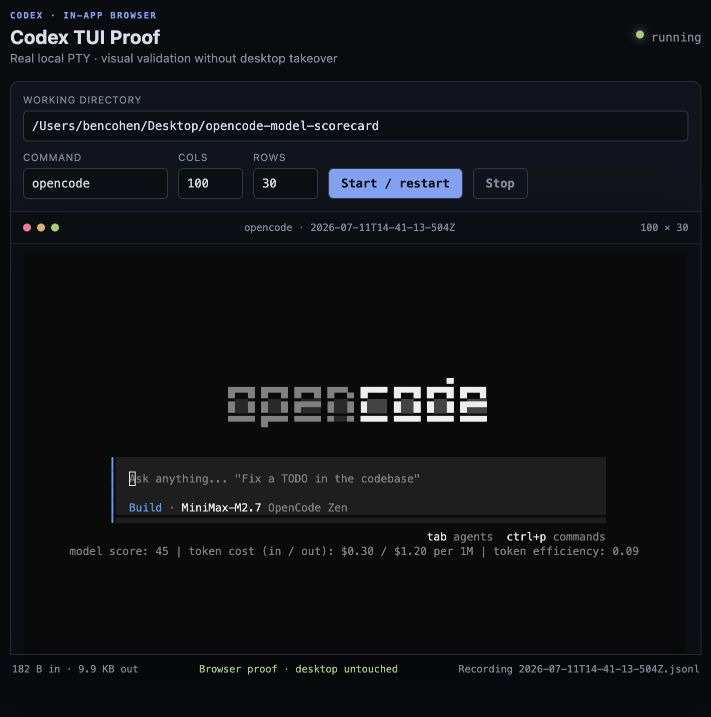

# Codex TUI Proof

Visual validation for real terminal UIs, inside Codex, without taking over the desktop.



Codex TUI Proof launches a real local PTY, renders it in a deterministic browser terminal, and gives Codex a repeatable workflow for keyboard interaction, screenshots, and session evidence. It is built for developers shipping interactive CLIs and TUIs who want visual proof alongside code changes.

## Install

Requirements: the ChatGPT desktop app with the **Browser** plugin enabled, a Codex CLI release with `codex plugin` commands (verified with `0.144.2`), and Node.js 20 or newer with npm.

```sh
codex plugin marketplace add bnc4vk/codex-tui-proof
codex plugin add codex-tui-proof@codex-tui-proof
```

Start a new Codex task so the skill is loaded, then ask:

```text
$validate-tui-in-codex visually validate this TUI at 100x30 and attach screenshots.
```

The first proof installs three locked runtime dependencies locally. Later runs start immediately. The plugin has been tested on macOS; the runtime also handles Windows and Unix shells, with CI covering macOS, Windows, and Linux.

### Install from the desktop app

Open **Settings → Plugins**, choose **Add more**, and enter:

```text
https://github.com/bnc4vk/codex-tui-proof.git
```

Install **Codex TUI Proof** from that marketplace and start a new task.

## What Codex does

1. Starts the bundled localhost PTY bridge in the integrated terminal.
2. Opens the exact allocated `127.0.0.1` URL in Codex's in-app browser.
3. Checks command, working directory, terminal geometry, and session status.
4. Drives the requested keyboard flow and observes the resulting state.
5. Captures a controlled-tab screenshot plus structured session evidence.
6. Stops the local harness when validation is complete.

The workflow explicitly refuses to fall back to Computer Use, Terminal.app, iTerm, or desktop keyboard automation.

## Why not a headless TUI test?

Headless tools are excellent for assertions. Codex TUI Proof covers a different gap: a coding agent needs to see and interact with the rendered TUI while it works, then hand the developer reviewable visual evidence.

| Capability | Codex TUI Proof | Headless TUI test | Desktop automation |
|---|---:|---:|---:|
| Real local PTY | Yes | Varies | Yes |
| Visible in Codex | Yes | Usually no | Indirectly |
| Deterministic geometry | Yes | Yes | Varies |
| Screenshot evidence | Yes | Varies | Yes |
| Leaves desktop untouched | Yes | Yes | No |
| Structured session evidence | Yes | Varies | No |

This is not a new terminal emulator or a replacement for ttyd, shell-use, Termless, VirtUI, or VHS. See the [prior-art review](docs/prior-art.md) for the architecture decision.

## Agent-facing contract

The launcher emits one machine-readable readiness line:

```text
TUI_PROOF_READY {"url":"http://127.0.0.1:<port>","command":"...","cwd":"...","cols":100,"rows":30}
```

Codex uses that URL verbatim. Stable browser selectors and JSON endpoints expose status, dimensions, command, working directory, byte counts, and the local recording path. The full contract is in [evidence-contract.md](skills/validate-tui-in-codex/references/evidence-contract.md).

Useful prompts:

```text
$validate-tui-in-codex check the command palette, select an item, and attach proof.

$validate-tui-in-codex verify this resize fix at 80x24 and 120x40.

$validate-tui-in-codex reproduce the broken keyboard flow, fix it, and re-run the proof.
```

## Direct launcher and diagnostics

Codex normally runs these commands for you:

```sh
node scripts/tui-proof.mjs doctor

node scripts/tui-proof.mjs start \
  --command "opencode" \
  --cwd "/path/to/worktree" \
  --cols 100 \
  --rows 30 \
  --port 0
```

`--port 0` prevents collisions between concurrent tasks. Run `node scripts/tui-proof.mjs --help` for the complete launcher syntax.

Commands are parsed into an executable and arguments and are not interpolated into a shell command. On Windows, a fixed PowerShell bridge resolves executables while keeping the parsed arguments separate. Shell operators such as pipes and redirects are intentionally unsupported; put complex setup in a reviewed script and launch that script instead.

## Privacy and security

- The HTTP and WebSocket server bind only to `127.0.0.1`.
- There is no telemetry, account, hosted service, or remote data store.
- Session recordings include terminal input and output. Do not type secrets into a proof session.
- The target executable runs directly with the launcher's local user permissions and may access the network if it normally does.
- The first run contacts npm to install the three versions pinned in `runtime/package-lock.json`.

Read [PRIVACY.md](PRIVACY.md) and [SECURITY.md](SECURITY.md) before using the plugin with sensitive projects.

## Development

```sh
npm ci --prefix runtime
npm run check --prefix runtime
npm test --prefix runtime
```

Contributions are welcome. Start with [CONTRIBUTING.md](CONTRIBUTING.md), and use [SECURITY.md](SECURITY.md) for vulnerability reports.

## License

[MIT](LICENSE) © 2026 Ben Cohen
