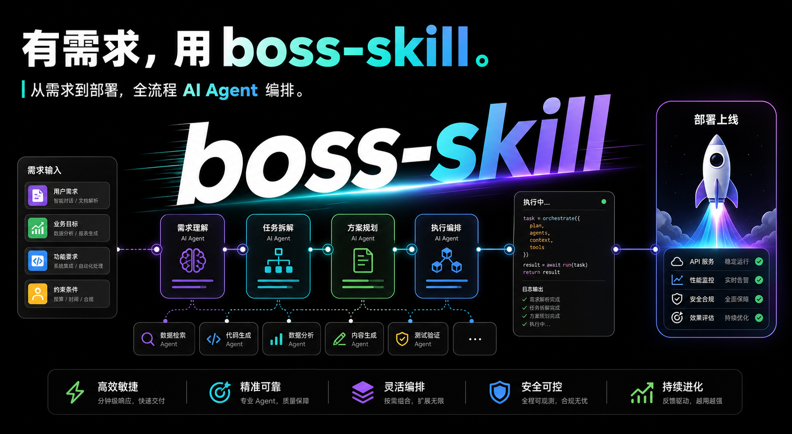

# boss-skill

[](https://www.npmjs.com/package/@blade-ai/boss-skill)
[](https://coderabbit.ai)



BMAD Harness Engineer — 全自动研发流水线编排 Skill，兼容 Claude Code、OpenClaw、Codex、Antigravity、Hermes。

从需求到部署的完整研发流水线，编排 9 个专业 Agent 自动完成完整研发周期。

> **定位说明**：Boss 提供可审计的 runtime 工作流与质量门禁；子 Agent 仍需按协议配合。门禁与 DAG 由 CLI/hooks 约束，**不能**等同于「装了就 100% 自动交付」——见下方 [质量与评测](#质量与评测)。

## 适合 / 不适合用 Boss

| 适合 | 不适合（直接让 Agent 改即可） |
|------|------------------------------|
| 新 feature：从需求到可运行/可部署 | 单文件修改、一行 bug、改个变量名 |
| 需要 PRD、架构、任务拆解、测试证据 | 纯读代码、解释实现、代码审查问答 |
| 团队希望产物落在 `.boss/<feature>/` 可追溯 | 已有完整 spec，只想快速 patch |
| API/全栈/带 UI 的中小项目 | 极小事（<30 分钟人工能做完） |

**经验法则**：若你不需要 `.boss/` 里一整套文档与门禁记录，就不要开 `/boss`。

## 5 分钟快速上手

**目标**：用最少角色跑通一条 feature，先熟悉产物目录与 runtime，再开完整 9 Agent 流水线。

### 1. 安装并启动 Agent

```bash
npm install -g @blade-ai/boss-skill
boss-skill
# Claude Code:
claude --plugin-dir "$(boss-skill path)"
```

### 2. 在 Agent 里触发（推荐轻量参数）

```
/boss 做一个 Todo 应用，个人用户本地记录 --roles core --skip-deploy
```

- `--roles core`：PM / Architect / Dev / QA，跳过 UI Designer、Scrum Master、DevOps 等重型角色
- `--skip-deploy`：只做到开发与测试证据，不跑部署阶段

### 3. 跑完后应看到的目录

```
.boss/todo-app/
├── design-brief.md      # 需求澄清（非 --quick 时）
├── prd.md
├── architecture.md
├── tasks.md
├── qa-report.md
└── .meta/
    ├── events.jsonl       # 状态真相源（只通过 boss runtime 追加）
    ├── execution.json     # 只读投影（调度看 workflow.nextNodeIds）
    └── workflow-plan.json
```

### 4. 本地自检（可选）

```bash
boss status todo-app --json
boss runtime inspect-pipeline todo-app
npm run evals                    # 默认 smoke 确定性评测
npm run evals:release            # release + pipeline-compliance
```

**下一步**：熟悉后去掉 `--roles core`，按需加 UI、部署；大项目保留完整 `full` 流水线。

## 安装

```bash
npm install -g @blade-ai/boss-skill
boss-skill
```

CLI 自动检测已安装的 Coding Agent，一条命令全部搞定：

```
Detected 5 agent(s):

  ✅ OpenClaw: ~/.openclaw/skills/boss       (copied + metadata injected)
  ✅ Codex: ~/.codex/skills/boss             (copied + metadata injected)
  ✅ Antigravity: ~/.gemini/.../skills/boss   (copied + metadata injected)
  ✅ Hermes: ~/.hermes/skills/boss           (copied + metadata injected)
  ✅ Claude Code: plugin ready at /path/to/boss-skill
     Use:  claude --plugin-dir "$(boss-skill path)"
```

| Agent | 检测条件 | 安装方式 |
|-------|---------|---------|
| **OpenClaw** | `~/.openclaw/` 存在 | 复制到 `~/.openclaw/skills/boss/` + 注入 `metadata.openclaw` |
| **Codex** | `~/.codex/` 存在 | 复制到 `~/.codex/skills/boss/` + 注入 `metadata.codex` |
| **Antigravity** | `~/.gemini/antigravity/` 存在 | 复制到 `~/.gemini/antigravity/skills/boss/` + 注入 `metadata.antigravity` |
| **Hermes** | `~/.hermes/` 存在 | 复制到 `~/.hermes/skills/boss/` + 注入 `metadata.hermes` |
| **Claude Code** | 始终 | Plugin 模式 — `claude --plugin-dir "$(boss-skill path)"` |

### Claude Code 使用

Claude Code 采用原生 Plugin 架构，无需复制文件到项目：

```bash
claude --plugin-dir "$(boss-skill path)"
```

启动后即可使用 `/boss` 命令、9 个 Agent、所有 hooks 和 skills。

升级：

```bash
npm update -g @blade-ai/boss-skill
```

## 工作原理

```
用户一句话 → [需求澄清] → [PM → Architect → UI] → [Tech Lead → Scrum Master] → [Dev → QA] → [DevOps] → 交付
              Step 0        阶段 1: 规划              阶段 2: 评审+拆解          阶段 3: 开发    阶段 4: 部署
```

### 需求澄清（Brainstorming）

用户只说了一句话（如"帮我做个记账 APP"），Boss 会自动判断需求完整度：

| 用户输入 | 判断 | 处理 |
|---------|------|------|
| "帮我做个记账 APP" | 缺「给谁用」和「核心场景」 | → 自动启动需求澄清 |
| "做一个面向设计师的素材管理工具，能上传、搜索、分类" | 三要素齐全 | → 确认后直接开跑 |

三要素检查：**做什么** + **给谁用** + **核心场景**。缺任何一个就自动触发 brainstorming，把一句话翻译成一页纸的 `design-brief.md`。

### 四阶段流水线

- **阶段 1 — 规划**：PM 需求穿透 → Architect 架构设计 → UI Designer 输出 `ui-spec.md` + `ui-design.json`（并行）
- **阶段 2 — 评审**：Tech Lead 技术评审 → Scrum Master 任务拆解
- **阶段 3 — 开发**：Frontend + Backend 并行开发 → 执行中会话对齐 → QA 测试 → 质量门禁
- **阶段 4 — 部署**：DevOps 构建部署 → 最终报告

每个阶段由 Harness Engine 驱动，状态机追踪，门禁不可绕过。

### 执行中会话层

Boss 仍然以文档为正式媒介，但执行过程不再只有“交付文档”这一种协作方式：

- 任意 Agent 可发起 `ask`、`challenge`、`propose`、`request_change`、`escalate`、`huddle`、`resolve`
- 每条会话都必须锚定到 `artifact`、`task`、`scope` 或 `decision`
- `resolve` 后必须落成至少一个 single-owner todo；只有触及正式 source of truth 时才升级为正式修订循环

## 9 个专业 Agent

| Agent | 职责 |
|-------|------|
| PM | 需求穿透 — 显性、隐性、潜在、惊喜需求 |
| Architect | 架构设计、技术选型、API 设计 |
| UI Designer | UI/UX 设计规范 + 可渲染设计 JSON |
| Tech Lead | 技术评审、风险评估 |
| Scrum Master | 任务分解、测试用例定义 |
| Frontend | UI 组件、状态管理、前端测试 |
| Backend | API、数据库、后端测试 |
| QA | 测试执行、Bug 报告 |
| DevOps | 构建部署、健康检查 |

## 使用方式

触发词：`boss mode`、`/boss`、`全自动开发`、`从需求到部署`

```
/boss 做一个 Todo 应用
/boss 用户认证 --template
/boss 给现有项目加用户认证 --skip-ui
/boss 把现有原生 HTML 组件迁移成 shadcn 组件
/boss 快速搭建 API 服务 --skip-deploy --quick
/boss 继续上次中断的任务 --continue-from 3
/boss 轻量模式 --roles core --hitl-level off
```

Boss 支持自然语言需求：执行前会先推导一个英文 kebab-case 的 feature slug 作为产物目录名，例如“做一个 Todo 应用”会落到 `.boss/todo-app/`。如果用户只是补充技术约束或团队偏好，例如“不要用原生 html 组件，我们引入了 shadcn”，Boss 会暂停并询问这条约束要应用到哪个 feature，而不是新建目录。

| 参数 | 说明 |
|------|------|
| `--skip-ui` | 跳过 UI 设计（纯 API/CLI） |
| `--skip-deploy` | 跳过部署阶段 |
| `--quick` | 跳过确认节点和需求澄清，全自动 |
| `--template` | 初始化项目级模板目录（`.boss/templates/`）并暂停流水线 |
| `--continue-from <1-4>` | 从指定阶段继续，跳过已完成阶段 |
| `--hitl-level <level>` | 人机协作：`auto`（默认）/ `interactive` / `off` |
| `--roles <preset>` | 角色预设：`full`（默认，9 个）/ `core`（PM/Architect/Dev/QA） |

## Harness Engine

### 状态机

每个阶段遵循状态转换：`pending → running → completed/failed → retrying → running`

状态变更通过 `boss runtime ...` 直接追加到 `.meta/events.jsonl`，再由 CLI runtime 的 projector 物化为只读的 `.meta/execution.json`。

### Runtime / CLI 编排面

`boss runtime <command>` 是唯一的 runtime-first surface。对外能力以 Boss CLI 为准，不再把 shell wrapper 视为兼容契约。

### Agent-Friendly CLI Contract

Agent-facing `boss` commands use these common options where applicable; run `--describe` on a command for its exact JSON schema:

- `--json`: structured output; non-TTY stdout defaults to JSON
- `--describe`: JSON command schema
- `--dry-run`: structured action plan for writes or risky operations
- `--json-input=<json|->`: JSON input payload
- `--fields=<a,b>` and `--limit=<n>`: bounded output
- `--yes`: required only for high-risk non-interactive commands that need an extra confirmation; for `project init --force`, `--force` is the overwrite confirmation

Structured errors are written to stderr as `{"error":{...}}` and include `code`, `message`, `input`, `retryable`, and `suggestion`.

| 编排动作 | Runtime CLI |
|------|------|
| 初始化流水线（低阶；`project init` 未执行时） | `boss runtime init-pipeline` |
| 恢复 Workflow 执行图并查看节点级复用决策 | `boss runtime resume <feature> --from-run <run-id>` |
| 查询 ready artifacts | `boss runtime get-ready-artifacts` |
| 记录产物完成 | `boss runtime record-artifact` |
| 更新阶段状态 | `boss runtime update-stage` |
| 更新 Agent 状态 | `boss runtime update-agent` |
| 执行门禁 | `boss runtime evaluate-gates` |
| 注册插件 | `boss runtime register-plugins <feature>` |
| 执行插件 Hook | `boss runtime run-plugin-hook` |
| 检查阶段状态 | `boss runtime check-stage` |
| 回放事件/快照 | `boss runtime replay-events` |
| 诊断流水线状态 | `boss runtime inspect-pipeline` |
| 查看最近事件 | `boss runtime inspect-events` |
| 查看 progress 流 | `boss runtime inspect-progress` |
| 查看插件生命周期 | `boss runtime inspect-plugins` |
| 生成流水线报告 | `boss runtime generate-summary` |
| 生成诊断页 | `boss runtime render-diagnostics` |
| 开启会话 | `boss runtime open-conversation` |
| 追加会话消息 | `boss runtime append-conversation-message` |
| 解决会话 | `boss runtime resolve-conversation` |
| 查看会话列表 | `boss runtime list-conversations` |
| 物化待办 | `boss runtime materialize-todo` |
| 查看待办列表 | `boss runtime list-todos` |
| 提取记忆 | `boss runtime extract-memory` |
| 查询记忆 | `boss runtime query-memory` |
| 构建记忆摘要 | `boss runtime build-memory-summary` |
| 记录反馈 | `boss runtime record-feedback` |
| 重试 Agent | `boss runtime retry-agent` |
| 重试阶段 | `boss runtime retry-stage` |

Pack 选择和插件生命周期现在都是 runtime 事件，不再只是 shell 侧副作用：
- pack 选择通过 `PackApplied` 进入状态真相。
- 插件发现/激活通过 `PluginDiscovered` / `PluginActivated` 进入事件流。
- 插件 hook 执行通过 `PluginHookExecuted` / `PluginHookFailed` 进入事件流。

Workflow 定义和运行实例分离：
- 初始化时会把选中的 pipeline pack + artifact DAG 编译为 `.boss/<feature>/.meta/workflow-plan.json`。
- `workflowPlanPath` / `workflowHash` / `packHash` / `artifactDagHash` 描述可审计的 Workflow 定义。
- `runId` 描述本次运行实例；`boss runtime resume <feature> --from-run <run-id>` 会重新加载 workflow plan，按节点输入指纹判断 `reuse` / `run` / `skip`，并把结果物化到 `execution.workflow.nodes`。
- `execution.workflow.nextNodeIds` 是机器可读的下一批可调度节点；DAG loop 应优先读取它，再派发对应 Agent 或 Gate。
- `GateEvaluated` / `WaveVerified` 会更新对应 workflow node 状态，让门禁和 Evidence Wave 不再只是外围检查。

四期排障 CLI 已开始补齐：
- `boss runtime inspect-pipeline` 查看当前阶段、ready artifacts、active agents、pack、plugins、metrics。
- `boss runtime inspect-events` 查看最近事件并支持按类型过滤。
- `boss runtime inspect-progress` 查看 progress flow。
- `boss runtime inspect-plugins` 查看 active/discovered/activated/executed/failed 插件状态。
- `boss runtime check-stage` / `boss runtime replay-events` 直接承担状态排障和事件回放。

四期报告 runtime 已抽离为独立的 summary model + renderer：
- `boss runtime generate-summary` 是 canonical summary surface，默认输出 Markdown，也支持 `--json` 和 `--stdout`。
- `packages/boss-cli/src/runtime/report/summary-model.ts` 负责从 `execution.json` 构建统一 summary model。
- `packages/boss-cli/src/runtime/report/render-markdown.ts` 负责渲染 `summary-report.md`。
- `packages/boss-cli/src/runtime/report/render-json.ts` 负责渲染机器可读的 JSON 报告。
- `packages/boss-cli/src/runtime/report/render-html.ts` + `boss runtime render-diagnostics` 负责生成最小 HTML 诊断页。

### 质量门禁

三层门禁，不可绕过：

| 门禁 | 时机 | 检查内容 |
|------|------|---------|
| Gate 0 | 开发后、测试前 | TypeScript 编译、Lint |
| Gate 1 | QA 后、部署前 | 测试覆盖率 ≥ 70%、无 P0/P1 Bug、E2E 通过 |
| Gate 2 | 部署前（Web） | Lighthouse ≥ 80、API P99 < 500ms |

支持通过插件扩展自定义门禁。

### Hook Profile

通过环境变量控制 hook 运行级别：

| 环境变量 | 说明 | 值 |
|----------|------|-----|
| `BOSS_HOOK_PROFILE` | Hook 运行级别 | `minimal` / `standard`（默认）/ `strict` |
| `BOSS_DISABLED_HOOKS` | 禁用指定 hook | 逗号分隔的 Hook ID |

11 个 Node.js hooks 覆盖完整 Agent 生命周期：session 启停、文件读写守卫、bash 命令捕获、子 Agent 调度、流水线退出保护、通知。

### 子代理协议

所有子代理使用标准化状态报告：

| 状态 | 含义 |
|------|------|
| `DONE` | 任务完成 |
| `DONE_WITH_CONCERNS` | 完成但有疑虑 |
| `NEEDS_CONTEXT` | 需要更多上下文 |
| `BLOCKED` | 被阻塞，无法继续 |
| `REVISION_NEEDED` | 会话触及正式真相源，需要进入修订循环 |

状态块在相关时还要携带 `conversation_id`、`resolution_summary`、`todo_ids` 和 `revision_target`，让执行中会话能够回放到具体待办或正式修订目标。

### Session 记忆持久化

- SessionEnd 保存流水线状态到 `.boss/.session-state.json`
- SessionStart 加载状态恢复上下文，跨 session 无缝继续

### 插件系统

通过 `.boss/plugins/` 注册自定义 gate、agent 或 pipeline 模板包。内置 5 套 Pipeline Pack（default、core、api-only、web-app、solana-contract）。

## 模板系统

Boss 支持项目级模板覆盖：

```bash
/boss 用户认证 --template    # 初始化 .boss/templates/
```

模板查找优先级：`.boss/templates/` > 包内置 `skill/templates/`（安装后为 Skill 根目录下的 `templates/`）。

## 产物目录

```
.boss/<feature>/
├── design-brief.md     # 需求澄清产出（可选）
├── prd.md              # 阶段 1: 产品需求
├── architecture.md     # 阶段 1: 系统架构
├── ui-spec.md          # 阶段 1: UI 规范（可选）
├── ui-design.json      # 阶段 1: 可渲染 UI 设计（可选）
├── tech-review.md      # 阶段 2: 技术评审
├── tasks.md            # 阶段 2: 开发任务
├── qa-report.md        # 阶段 3: QA 报告
├── deploy-report.md    # 阶段 4: 部署报告
├── summary-report.md   # 流水线报告（Harness 自动生成）
└── .meta/
    └── execution.json  # 执行追踪（状态机 + 门禁 + 指标）
```

可在交互式环境运行 `boss design preview <feature>` 预览 `.boss/<feature>/ui-design.json`。

## 质量与评测

Boss 的质量保障分两层：

1. **硬约束（CI 可验证）**：runtime 事件流、禁止直接写 `execution.json`、hooks、install matrix、harness 场景 —— `npm test` 覆盖。
2. **软约束（依赖 Agent 遵从）**：按 DAG 派发子 Agent、渐进式读取 reference、测试与门禁 —— 由 Skill 协议驱动。

**确定性 Eval**（不启动真实 LLM，评分已捕获的 fixture）：

```bash
npm run evals                              # smoke-success
npm run evals:release                      # release-evidence + pipeline-compliance
```

`pipeline-compliance` 额外检查 transcript 是否出现 `boss runtime` / `record-artifact`、是否避免手改 `execution.json`、以及 `execution.workflow` 调度字段。真实 Agent 跑完后，可将 workspace + transcript 固化为新 fixture，再用 `--case` 评分。详见 [test/evals/README.md](./test/evals/README.md)。

## 开发

### 环境要求

- Node.js >= 20
- jq（Shell 脚本依赖，`brew install jq`）

### 安装与测试

```bash
git clone https://github.com/echoVic/boss-skill.git
cd boss-skill
npm install
npm run build
npm run typecheck
npm test
```

### 源码与产物布局

- `packages/boss-cli/src/` 是 CLI 和 runtime 的 TypeScript/ESM 源码入口。
- `packages/boss-cli/dist/` 是 `npm publish` 和包内 `bin` 指向的构建产物，不要手改。
- `packages/boss-cli/assets/` 保存 Boss CLI 内置 DAG、Pipeline Packs、plugin schema 和内置插件。
- `boss runtime <command>` 是稳定入口，skill 和 hooks 不直接调用内部 runtime 文件。
- `npm test` 运行 Vitest；测试文件统一放在 `test/**/*.test.ts`。

### 发布

使用统一发布脚本，自动同步所有文件的版本号（`package.json`、`skill/SKILL.md`、`plugin.json`、`marketplace.json`）：

```bash
# 语义化升级
npm run release -- patch          # 3.2.0 → 3.2.1
npm run release -- minor          # 3.2.0 → 3.3.0
npm run release -- major          # 3.2.0 → 4.0.0

# 指定版本号
npm run release -- 3.5.0

# 预览（不改任何文件）
npm run release -- 3.5.0 --dry-run

# 只改版本 + 提交 + tag，不发 npm
npm run release -- 3.5.0 --no-publish
```

发布流程：检查工作区干净 → 运行测试 → 同步版本号 → 验证一致性 → git commit + tag → npm publish。

详见 [CONTRIBUTING.md](./CONTRIBUTING.md)。

## 文件结构

```
boss-skill/
├── packages/
│   └── boss-cli/
│       ├── src/                         # Boss CLI + runtime TypeScript 源码
│       ├── dist/                        # CLI 编译产物（npm bin）
│       └── assets/                      # 内置 DAG、packs、plugin schema、内置插件
├── skill/                            # 安装到 agent 的薄 skill bundle
│   ├── SKILL.md                      # 核心编排流程（通用 frontmatter，无平台 metadata）
│   ├── agents/                       # 9 个 Agent Prompt + shared/prompts
│   ├── commands/                     # 斜杠命令（/boss、/boss:upgrade）
│   ├── hooks/                        # hook 配置（claude + codex 双平台）
│   ├── references/                   # 按需加载的规范文档
│   ├── templates/                    # 10 个产物模板
│   └── skills/                       # 25+ 子 skill（按 Agent 角色分类）
├── scripts/
│   ├── release.js                    # 统一发布脚本
│   ├── lib/                          # Hook 运行辅助 JS
│   └── hooks/                        # 11 个 Node.js Hook 脚本
├── .claude-plugin/
│   ├── plugin.json                   # Claude Code Plugin 清单
│   └── marketplace.json
├── .codex-plugin/
│   ├── plugin.json                   # Codex Plugin 清单
│   └── marketplace.json
└── package.json
```

## 设计理念

基于 BMAD（Breakthrough Method of Agile AI-Driven Development）方法论，详见 `skill/references/bmad-methodology.md` 和 `DESIGN.md`。

## 贡献

欢迎贡献！请阅读 [CONTRIBUTING.md](./CONTRIBUTING.md) 了解开发流程、代码规范和提交约定。

## Star History

[](https://star-history.com/#echoVic/boss-skill&Date)

## License

MIT
