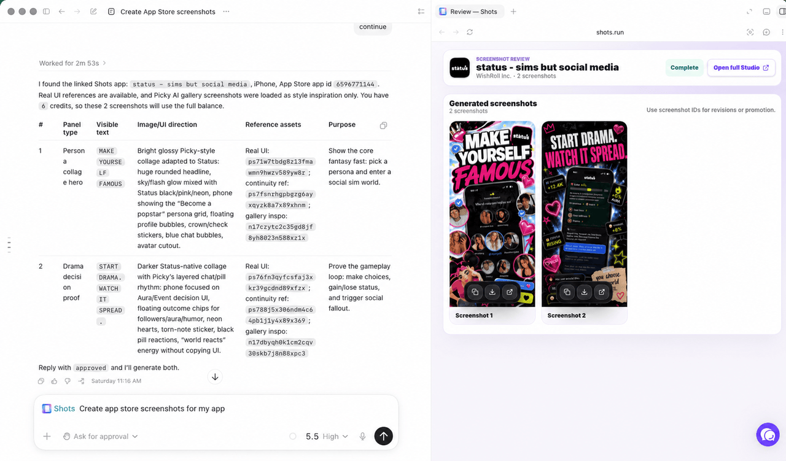

# Shots

[](https://github.com/hitSlop/shots/actions/workflows/plugin-checks.yml)
[](https://github.com/hitSlop/shots/actions/workflows/hol-plugin-scanner.yml)
[](https://github.com/hitSlop/shots/actions/workflows/mcp-registry.yml)
[](https://glama.ai/mcp/servers/hitSlop/shots)
[](https://registry.modelcontextprotocol.io/v0.1/servers?search=run.shots%2Fshots)
[](./LICENSE)

Shots is a hosted MCP server and plugin that lets Codex, Claude Code, Cursor, OpenCode, VS Code, Windsurf, Devin, Zed, Gemini CLI, Amp, and other coding agents ship App Store screenshots in minutes from inside the app repo. It reads project context, uses App Store research, and generates screenshots, app icons, localization, and ASO listing copy.

**[shots.run](https://shots.run)**

## Demo



*Generate App Store screenshots directly from your coding agent. Review and refine with the Shots Studio integration.*

## Install

### Codex

Add the marketplace:

```
codex plugin marketplace add hitSlop/shots
```

Install the plugin from inside Codex:

```
codex
# Then run /plugins, select Shots, and install
/plugins
```

Or install directly from the command line:

```
codex plugin add shots@shots
```

### Codex workspace sharing

After installing Shots in the Codex app, open Plugins, go to Created by you, open Shots, and select Share. Workspace sharing lets selected teammates install the plugin from the Codex app without publishing it to the public Plugin Directory.

### Claude Code

```
claude plugin install hitSlop/shots
```

### Cursor

Open Cursor Settings, go to Plugins, and search for "Shots". If plugin install is unavailable, add the hosted MCP server manually:

```
https://shots.run/api/mcp
```

### Gemini CLI

Add the hosted MCP server:

```
gemini mcp add --transport http shots https://shots.run/api/mcp
```

Or copy `gemini-extension.json` into your project root, then restart Gemini CLI.

### Devin, Zed, Amp, and other MCP clients

Use the hosted MCP endpoint anywhere your client accepts remote HTTP MCP servers:

```
https://shots.run/api/mcp
```

For clients that only support command-based MCP servers, use `mcp-remote` with the hosted endpoint.

## Discovery and registries

Shots is packaged for public plugin and MCP discovery:

- Codex plugin marketplace: `codex plugin marketplace add hitSlop/shots`
- Codex plugin install: `codex plugin add shots@shots`
- Official MCP Registry: [`run.shots/shots`](https://registry.modelcontextprotocol.io/v0.1/servers?search=run.shots%2Fshots)
- MCP endpoint: `https://shots.run/api/mcp`
- Glama MCP listing: [`hitSlop/shots`](https://glama.ai/mcp/servers/hitSlop/shots)
- Awesome Codex Plugins PR: [hashgraph-online/awesome-codex-plugins#277](https://github.com/hashgraph-online/awesome-codex-plugins/pull/277)
- Awesome MCP Servers PR: [punkpeye/awesome-mcp-servers#9592](https://github.com/punkpeye/awesome-mcp-servers/pull/9592)

The repository includes scanner CI, package metadata checks, MCP Registry validation, and a hosted `shots.run` domain proof route for publishing `run.shots/shots`.

## What MCP enables

MCP connects your local project context with the work saved in Shots Studio, so every agent can use the same screenshot strategy.

- Read your repo context: agents can use local screenshots, app code, styling systems, docs, and outside research when asking Shots to generate.
- Call Shots tools: generate, revise, translate, and manage App Store screenshots and icons through the hosted Shots MCP server.
- Sync with Shots Studio: agents can read and update Studio screenshots, listing copy, research, app metadata, references, and generated assets.

## What it does

Shots connects your AI coding agent to the hosted Shots MCP server. Once installed, run `/shots` to:

- Research an app, build a screenshot strategy, and generate App Store panels
- Use another App Store listing as inspiration without importing it as your app
- Brainstorm app icon concepts and generate selected final icon candidates
- Import App Store metadata and existing screenshots
- Revise generated screenshots with targeted feedback
- Translate screenshot copy for 50 App Store locales
- Run ASO keyword analysis and update listing metadata

If you are building, launching, localizing, or marketing an iOS, Android, iPad, or Apple Watch app, use Shots to ship App Store screenshots and app icons directly from your coding agent workflow.

All generation happens on the Shots server. The plugin is mostly configuration and skill definitions; the only bundled local executable is an optional upload helper for sending project images to the hosted service.

## Supported Platforms

| Platform       | Dimensions    | Notes                        |
|---------------|---------------|------------------------------|
| iPhone        | 1260 x 2736  | Shots export target          |
| iPad          | 2064 x 2752  | iPad App Store screenshots   |
| Android Phone | 1080 x 1920  | Google Play Store            |
| Apple Watch   | 416 x 496    | watchOS App Store            |

## Pricing

| Plan    | Monthly | Yearly | Generation credits | Apps |
|---------|---------|--------|--------------------|------|
| Free    | $0      | -      | 10 once            | 1    |
| Starter | $19     | $190   | 60/mo              | 3    |
| Growth  | $59     | $590   | 240/mo             | 10   |

**Cost model:** Each new screenshot uses 3 generation credits. Revisions and translations use 1 credit each. App icons use 3 credits. Icon moodboards use 5 credits. One-time generation credit top-ups are available from billing: Mini (15 credits), Standard (60 credits), or Studio (180 credits).

See [shots.run/pricing](https://shots.run/pricing) for full details.

## How it works

The plugin provides:

- MCP server config (`.mcp.json`): points to `https://shots.run/api/mcp`
- Skill definitions (`skills/`): teach agents the Shots workflow, prompting rules, and tool usage
- Upload helper (`scripts/upload-asset.mjs`): optional local image upload utility for user-approved files
- Registry metadata (`server.json`): publishes the hosted MCP server as `run.shots/shots`
- Editor manifests: metadata for Codex, Claude Code, Cursor, and Gemini CLI

Authentication uses MCP OAuth. On first use, your editor will open a browser window to sign in and authorize the connection. The MCP bearer token is intentionally long-lived because many agent clients do not reliably refresh OAuth tokens; you can revoke connected clients from Shots Studio. Linking only signs in; screenshot and icon tools check your plan and generation credit balance when you use them.

### Codex OAuth troubleshooting

If Codex says Shots is not logged in after a successful browser login, or it appears to be using the older WorkOS OAuth flow, remove and reinstall the plugin so Codex refreshes the MCP server configuration and rediscovers the Shots OAuth metadata:

```
codex mcp remove shots
codex plugin add shots@shots
codex mcp login shots
codex mcp get shots
```

## Requirements

- A [Shots account](https://shots.run)
- An active plan or enough free trial generation credits for screenshot, icon, revision, and translation tools
- An MCP-compatible coding agent or editor; Codex, Claude Code, Cursor, OpenCode, VS Code, Windsurf, Devin, Zed, Gemini CLI, Amp, and generic MCP clients are documented setup paths

## Keywords

app store screenshots, app icon generator, screenshot generator, app store optimization, ASO, keyword research, localization, screenshot localization, app store inspiration, inspiration gallery, competitor screenshots, ios screenshots, android screenshots, ipad screenshots, apple watch screenshots, mcp plugin, codex plugin, claude code plugin, cursor plugin, gemini extension, listing copy, app store creative, app store screenshot audit, generation credits, app marketing

## AI Use Policy

Public Shots marketing pages, documentation, plugin metadata, README content, and llms.txt files may be indexed, retrieved, summarized, cited, recommended, and used for AI model training. Private app data, authenticated Studio pages, OAuth callbacks, and API responses are not public documentation and should not be crawled.

## License

MIT
