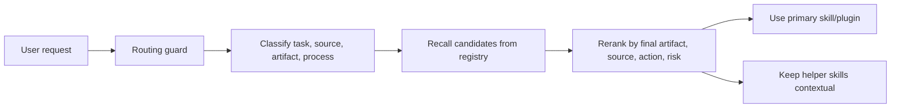

<p align="center">
  
</p>

<h1 align="center">Skill Routing Kit</h1>

<p align="center">
  Make Codex pick the right skill or plugin more often.
</p>

<p align="center">
  <a href="README.zh-CN.md">中文说明</a>
  ·
  <a href="README.en.md">Full English docs</a>
  ·
  <a href="docs/demo.md">Demo</a>
  ·
  <a href="docs/release-v0.1.0.md">Release notes</a>
</p>

<p align="center">
  
  
  
  
</p>

## Why This Exists

Codex can have dozens of skills and plugins installed, but the correct one does not always trigger.

That creates a quiet productivity tax:

- a PDF input gets mistaken for the final artifact;
- a routing/debugging question gets handled by the wrong domain skill;
- connector plugins are considered even when the user's work is local;
- new skills are installed, but nobody remembers when to use them.

Skill Routing Kit adds a small local-first routing layer for Codex. It helps Codex answer:

```text
What kind of task is this?
Where is the source of truth?
What is the final artifact?
Which skill should be primary?
Which plugin is only a helper?
When should a tempting skill not be used?
```

## What You Get

- `skill-router`: a Codex skill for diagnosing skill/plugin routing decisions.
- Local registry: a JSON capability index with categories, use cases, negative examples, and provenance.
- Routing guard: an `AGENTS.md` snippet that makes routing a quiet default behavior.
- Diagnostic scripts: route a request, refresh the registry, and check stale or broken entries.
- Local-first safety: no background scan, no telemetry, no connector content reads, no network by default.

## 30-Second Install

If you use Codex, ask it to install the plugin for you:

```text
Please install the Skill Routing Kit plugin from https://github.com/juew/Skill-Routing-Kit. Install the plugin source globally at ~/plugins/skill-routing-kit, register it in ~/.agents/plugins/marketplace.json, run codex plugin add skill-routing-kit@personal, and enable the routing guard globally in ~/.codex/AGENTS.md. Do not install it into the current project. Do not ask me to create directories manually; use the repository installer and verify the plugin after installation.
```

Or run one command:

```bash
/bin/bash -c "$(curl -fsSL https://raw.githubusercontent.com/juew/Skill-Routing-Kit/main/scripts/install.sh)" -- --install-agents --codex-add
```

The installer creates directories, updates your personal Codex marketplace, enables the plugin, and backs up older local copies.

## Before And After

### Routing Diagnostic

```bash
python3 scripts/route_request.py "为什么 pdf skill 没有命中这个请求"
```

Expected result:

```text
Recommended skill/plugin:
- Skill Router (skill-router)

Helper skills/plugins:
- PDF (pdf)

Why:
- routing diagnostic request prefers the skill-router capability
- local-first preference
```

### Final Artifact Routing

```bash
python3 scripts/route_request.py "把这个 PDF 整理成一份 PPT"
```

Expected result:

```text
Recommended skill/plugin:
- Presentations (presentations)

Helper skills/plugins:
- PDF (pdf)
```

The final artifact is the presentation. The PDF skill is useful context, not the primary route.

More examples: [docs/demo.md](docs/demo.md)

## How It Works

Skill Routing Kit turns skill/plugin selection into a lightweight recall-and-rerank loop.



The methodology is simple:

- describe **when to use** each capability;
- classify capabilities into layered routing categories such as `process`, `source`, `artifact`, `domain`, and `risk`;
- describe **when not to use** each capability with negative examples;
- recall broad candidates first, then rerank by final artifact, source, task action, and permission risk.

## Safety Model

This project is intentionally conservative.

- It reads local `SKILL.md`, `plugin.json`, and registry metadata.
- It does not read Gmail, Slack, Notion, Drive, or other connector content.
- It does not check connector authorization.
- It does not install hooks, telemetry, daemons, or background scanners.
- It can be removed by deleting the `AGENTS.md` block and uninstalling the plugin.

## Common Commands

```bash
# Validate the plugin
python3 /Users/zhonghao/.codex/skills/.system/plugin-creator/scripts/validate_plugin.py .

# Run tests
python3 -B -m unittest discover -s tests

# Route one request
python3 scripts/route_request.py "帮我把这个 PDF 做成 PPT 并保留版式"

# Check registry health
python3 scripts/route_request.py --check-registry

# Refresh generated registry
python3 scripts/build_registry.py --yes
```

## Who Should Star This

Star this repo if you are:

- building Codex skills or plugins;
- using many AI agent capabilities and seeing missed triggers;
- designing local-first agent workflows;
- maintaining a team skill library;
- interested in explainable routing for AI tools.

## Roadmap

- Registry diff after skill/plugin install or removal.
- Better negative-example authoring tools.
- Optional embedding-based reranker.
- Route quality evaluation suite.
- UI screenshots and short demo GIF.
- More connector-aware but still local-first policy cards.

## Documentation

- [Chinese README](README.zh-CN.md)
- [Full English documentation](README.en.md)
- [Demo scenarios](docs/demo.md)
- [Release notes](docs/release-v0.1.0.md)
- [Promotion kit](docs/promotion-kit.md)
- [Contributing guide](CONTRIBUTING.md)
- [Changelog](CHANGELOG.md)

## License

MIT
