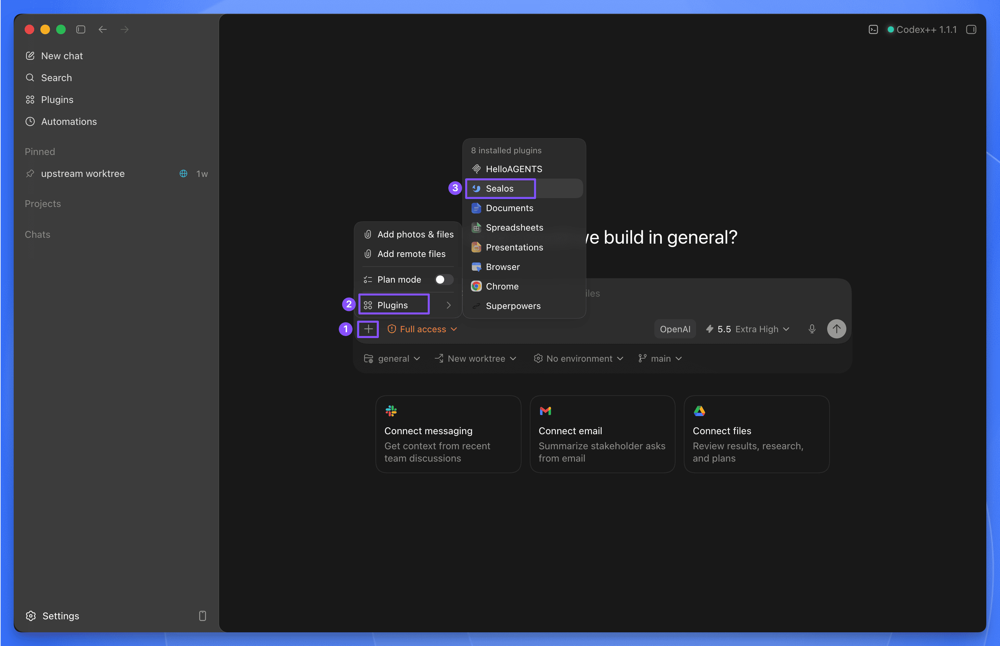

# Sealos Skills

Deploy projects to [Sealos Cloud](https://sealos.io) from your AI agent.

Sealos Skills is a plugin-first skill pack centered on Sealos Cloud development and deployment. It helps an AI agent inspect a project, prepare missing deployment artifacts, connect Sealos Cloud databases for development, build or reuse a container image, ship the app to Sealos Cloud, and view deployed resources in a local read-only canvas.

The recommended way to use it is as an agent plugin installed with [`npx plugins`](https://www.npmjs.com/package/plugins). The same root `skills/` directory also remains compatible with `skills.sh` and context-only extension hosts such as Gemini CLI and Qwen Code.

## Quick Start

### Recommended: install as a plugin

Install the Sealos plugin into Codex:

```bash
npx plugins add https://github.com/labring/sealos-skills --target codex
```

Install the Sealos plugin into Claude Code:

```bash
npx plugins add https://github.com/labring/sealos-skills --target claude-code
```

If you only use one detected agent tool on the machine, you can let `plugins` choose the target:

```bash
npx plugins add https://github.com/labring/sealos-skills
```

After installation, use the plugin from your agent:

- **Codex CLI:** type `$sealos`
- **Codex App:** click the **+** button in the lower-left corner of the chat input, choose **Plugins**, then choose **Sealos**
- **Claude Code:** type `/sealos`



Plugin examples:

```text
$sealos deploy this repo to Sealos Cloud
$sealos deploy /path/to/project
$sealos deploy https://github.com/labring-sigs/kite
$sealos create a cloud Postgres database for this repo and wire DATABASE_URL
```

For Claude Code, use the same requests with `/sealos`:

```text
/sealos deploy this repo to Sealos Cloud
/sealos deploy /path/to/project
/sealos deploy https://github.com/labring-sigs/kite
/sealos create a cloud Postgres database for this repo and wire DATABASE_URL
```

In Codex App, select **Sealos** from **Plugins**, then describe what you want to deploy.

### Other supported AI tools

| Tool | Install | Usage |
| --- | --- | --- |
| Codex CLI / Codex App | `npx plugins add https://github.com/labring/sealos-skills --target codex` | `$sealos` in Codex CLI, or **+** → **Plugins** → **Sealos** in Codex App |
| Claude Code | `npx plugins add https://github.com/labring/sealos-skills --target claude-code` | `/sealos` |
| Claude Code marketplace flow | `/plugin marketplace add labring/sealos-skills` | `/sealos` |
| OpenClaw / ClawHub | `clawhub install labring/sealos-skills` | Host command exposure depends on the ClawHub runtime |
| CodeBuddy | `/plugin marketplace add labring/sealos-skills` | Host command exposure depends on the CodeBuddy runtime |
| Gemini CLI | `gemini extensions install https://github.com/labring/sealos-skills` | Context-only extension; ask Gemini to use Sealos Skills |
| Qwen Code | `qwen extensions install https://github.com/labring/sealos-skills` | Context-only extension; ask Qwen to use Sealos Skills |
| Amp / Kimi / generic repo importers | Import `https://github.com/labring/sealos-skills.git` | Host-dependent |

Gemini CLI and Qwen Code manifests provide repository context through `CLAUDE.md`; they do not claim slash-command support.

### Alternative: install as a `skills.sh` skill pack

If your agent uses `skills.sh` directly, install the same skills pack with:

```bash
npx skills add labring/sealos-skills
```

Then run the deploy skill directly:

```text
/sealos-deploy
/sealos-deploy /path/to/project
/sealos-deploy https://github.com/labring-sigs/kite
```

After a project has been deployed, run a local Sealos resource canvas UI:

```text
/sealos-canvas
```

`/sealos-deploy` is the direct `skills.sh` skill entry. Plugin usage should go through `$sealos` in Codex or `/sealos` in Claude Code.

## Why Use the Plugin

Prefer the plugin install for Codex and Claude Code because it:

- installs all Sealos skills as one managed package
- exposes the same skills across supported agent tools
- keeps the plugin metadata, logo, prompts, commands, and capabilities together
- avoids maintaining a separate packaged copy of the skills

## Plugin Distribution

The Codex integration follows [OpenAI's Codex plugin build guide](https://developers.openai.com/codex/plugins/build):

- `.codex-plugin/plugin.json` contains plugin identity, discovery metadata, interface copy, default prompts, brand metadata, and asset paths relative to the repository root.
- `.agents/plugins/marketplace.json` registers this repo-local plugin for local Codex marketplace testing.
- `distribution/platforms.json` records platform support claims and evidence.
- `marketplaces/README.md` owns marketplace rules and prevents command-support overclaims.
- `scripts/validate-codex-plugin.py` validates the Codex manifest, repo marketplace, platform registry, and asset paths.
- `skills/**/SKILL.md` remains the only skill source; do not add a second packaged copy of the skills.

Validate plugin metadata before publishing or pushing manifest changes:

```bash
python3 scripts/validate-codex-plugin.py
python3 -m json.tool .codex-plugin/plugin.json >/dev/null
python3 -m json.tool .agents/plugins/marketplace.json >/dev/null
python3 -m json.tool distribution/platforms.json >/dev/null
```

## How Setup Works

You only need a plugin-compatible or `skills.sh` compatible AI agent and a project to deploy.

During the deploy and database flows, Sealos Skills will:

- check whether tools such as Docker and `kubectl` are available
- guide the user through Sealos login when needed
- use `sealos-cli` for Sealos Cloud database creation, connection details, and database operations
- use or help prepare a container registry path such as Docker Hub or GHCR

For an actual deployment, you will still need a Sealos Cloud account and access to a container registry, but these do not need to be fully set up before the skill starts. For database work, you need a Sealos Cloud account and a workspace that can create database resources.

## What Sealos Deploy Handles

On a typical deploy, the agent will:

- assess the project structure and runtime needs
- reuse an existing image or build one when needed
- generate a Sealos template
- deploy and verify rollout

Later runs can switch to an in-place update flow when an existing deployment is detected.

## What Sealos Database Handles

For a local project or Devbox that needs a cloud database, the agent will:

- detect database signals such as `DATABASE_URL`, Prisma, Drizzle, MongoDB, MySQL, or Redis
- use `sealos-cli database` to list, create, inspect, and connect Sealos Cloud databases
- write only the required local env key without exposing secrets in chat
- verify the app's real database path through migrations, introspection, or startup checks
- manage public access only after confirmation

## What Sealos Canvas Handles

For a repository already deployed by `/sealos-deploy`, the agent will:

1. Read `.sealos/state.json` to locate the deployed app.
2. Query the Sealos namespace with read-only `kubectl get` commands.
3. Start a temporary `127.0.0.1` canvas UI.
4. Output and open the local UI address for inspection.

If the project has not been deployed yet, `/sealos-canvas` stops and tells the user to run `/sealos-deploy` first.

## Included Skills

The plugin and `skills.sh` pack expose the same skill source:

- `sealos-deploy` — deploy a local or GitHub project to Sealos Cloud
- `sealos-database` — create, connect, and operate Sealos Cloud databases for development
- `sealos-canvas` — view deployed Sealos resources in a local read-only canvas UI
- `sealos-app-builder` — build Sealos Desktop apps with SDK integration
- `cloud-native-readiness` — assess deployment readiness
- `dockerfile-skill` — generate production-ready Dockerfiles
- `docker-to-sealos` — convert Docker Compose services into Sealos templates

## Repository

[`skills/`](./skills) is the single source of truth for Sealos deploy, Sealos canvas, and the supporting skills used during the deploy flow. The same root-level skills directory serves `skills.sh` installs and every plugin or extension manifest in this repository.

Important distribution files:

- [`.codex-plugin/plugin.json`](./.codex-plugin/plugin.json) — Codex plugin manifest
- [`.agents/plugins/marketplace.json`](./.agents/plugins/marketplace.json) — local Codex marketplace entry
- [`.claude-plugin/plugin.json`](./.claude-plugin/plugin.json) — Claude Code-compatible plugin manifest
- [`marketplace.json`](./marketplace.json) and [`.claude-plugin/marketplace.json`](./.claude-plugin/marketplace.json) — Claude-compatible marketplace entries
- [`.codebuddy-plugin/marketplace.json`](./.codebuddy-plugin/marketplace.json) — CodeBuddy marketplace entry
- [`gemini-extension.json`](./gemini-extension.json) — Gemini CLI context extension
- [`qwen-extension.json`](./qwen-extension.json) — Qwen Code context extension
- [`openclaw.plugin.json`](./openclaw.plugin.json) — OpenClaw / ClawHub bundle pointer
- [`commands/sealos.md`](./commands/sealos.md) — `/sealos` plugin command entry for compatible hosts
- [`distribution/platforms.json`](./distribution/platforms.json) — platform support registry
- [`marketplaces/README.md`](./marketplaces/README.md) — marketplace rules and support-claim ownership
- [`scripts/validate-codex-plugin.py`](./scripts/validate-codex-plugin.py) — Codex plugin validation

Do not add a second packaged copy of the skills. Root `skills/**` is the only skill source for all installation paths.

## License

MIT
