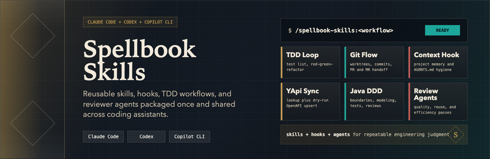
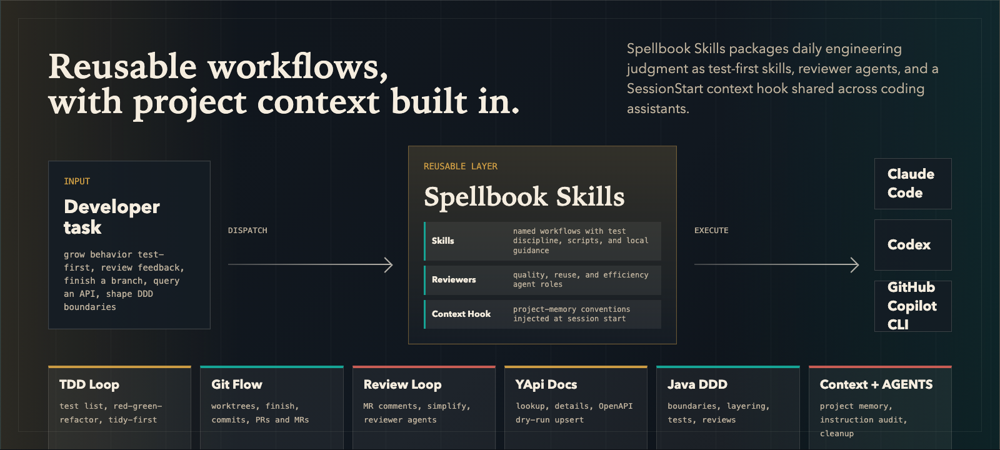

# Spellbook Skills

<p align="center">
  
</p>

<p align="center">
  <a href="./LICENSE"></a>
  
  
  
  
</p>

Personal skills library for daily workflows, packaged as Claude Code, GitHub Copilot CLI, and Codex plugins.

[中文说明](./README.zh-CN.md)

## Overview

Spellbook Skills is a collection of agent skills for daily development workflows — covering test-driven development, git worktrees, code review, API querying, DDD architecture guidance, and more. It also ships a **Project Context Hook** that injects framework-agnostic project-memory conventions into the agent at session and subagent start (see the [Project Context Hook](#project-context-hook) section below).

<p align="center">
  
</p>

## Requirements

- Claude Code v1.0.33+
- GitHub Copilot CLI for Copilot plugin, skill, and agent usage
- Codex CLI for Codex plugin and Codex agent role usage

## Install For Claude Code

Interactive Claude Code commands:

```
/plugin marketplace add yyykf/spellbook-skills
/plugin install spellbook-skills@spellbook-marketplace
/reload-plugins
```

Shell commands:

```bash
claude plugin marketplace add yyykf/spellbook-skills
claude plugin install spellbook-skills@spellbook-marketplace --scope user
```

The marketplace name is `spellbook-marketplace`, as declared by `.claude-plugin/marketplace.json`.

## Install For GitHub Copilot CLI

GitHub Copilot CLI can install the same remote marketplace and uses the Claude-compatible `.claude-plugin/plugin.json`, including both `skills/` and `agents/`.

```bash
copilot plugin marketplace add yyykf/spellbook-skills
copilot plugin install spellbook-skills@spellbook-marketplace
```

To update later:

```bash
copilot plugin marketplace update spellbook-marketplace
copilot plugin update spellbook-skills@spellbook-marketplace
```

The plugin provides the shared skills plus the reviewer agents declared in `.claude-plugin/plugin.json`.

## Install For Codex

Install the Codex plugin marketplace and plugin:

```bash
codex plugin marketplace add yyykf/spellbook-skills
codex plugin add spellbook-skills@spellbook-marketplace
```

Codex loads this plugin's skills through the plugin system, but custom reviewer agents must be installed separately as Codex agent role TOML files.
The installer uses only shell/PowerShell plus `curl` or `Invoke-WebRequest`; no Python runtime is required.

Project-scoped install, recommended for a single repository:

```bash
script="$(mktemp)"
trap 'rm -f "$script"' EXIT
curl -fsSLo "$script" https://raw.githubusercontent.com/yyykf/spellbook-skills/main/scripts/install-codex-agents.sh
bash "$script"
```

User-scoped install, available across repositories:

```bash
script="$(mktemp)"
trap 'rm -f "$script"' EXIT
curl -fsSLo "$script" https://raw.githubusercontent.com/yyykf/spellbook-skills/main/scripts/install-codex-agents.sh
bash "$script" --scope user
```

From a local checkout:

```bash
./scripts/install-codex-agents.sh --scope project
```

Windows PowerShell:

```powershell
$script = Join-Path $env:TEMP "install-codex-agents.ps1"
Invoke-WebRequest https://raw.githubusercontent.com/yyykf/spellbook-skills/main/scripts/install-codex-agents.ps1 -OutFile $script
powershell -NoProfile -ExecutionPolicy Bypass -File $script -Scope project
```

From a local checkout on Windows, `scripts/install-codex-agents.cmd` and `scripts/install-codex-agents.bat` are thin PowerShell wrappers.

The installer writes namespaced Codex roles under `agents/spellbook`:

- Project scope: `./.codex/agents/spellbook/*.toml`
- User scope: `${CODEX_HOME:-$HOME/.codex}/agents/spellbook/*.toml`

It does not overwrite existing files unless `--force` or `-Force` is provided.

## Usage

After installation, skills are namespaced by the plugin name:

```
/spellbook-skills:<skill-name>
```

## Skills

| Skill | Description |
| --- | --- |
| `using-git-worktrees-lite` | Create a worktree from the current branch with build/compile verification only (no tests) |
| `finishing-a-development-branch-lite` | Use build/compile verification as the completion gate, then merge/PR/keep/discard and clean up the worktree |
| `reviewing-gitlab-mr-comments` | Review GitLab MR comments via glab, summarize feedback, and propose a checklist or plan before execution |
| `yapi-skill` | Read and write YApi without running an MCP server: search interfaces, fetch interface details, and sync (upsert) one interface's docs from an OpenAPI contract via Python scripts (dry-run by default) |
| `simplify` | Review changed code for reuse, quality, and efficiency with three parallel review passes, then fix issues found. Codex uses the optional namespaced reviewer agents installed above. |
| `ddd-best-practices` | DDD architecture best practices for Java/Spring Boot — layering decisions, domain modeling, code templates, test strategy, review checklists, and MVC-to-DDD migration |
| `test-driven-development` | Red-green-refactor TDD discipline with Kent Beck's Tidy First (structural vs behavioral changes) and a Canon test list; language-agnostic core, with per-language notes for Java/TS/Python/Go/Rust |
| `git-commit` | Prepare Git commits from the real diff: read repo rules first, choose atomic splits, run lightweight checks, and generate Conventional Commit messages. Emoji is opt-in via `--emoji` after `type(scope):` |
| `git-merge-request` | One-shot commit + push + create merge request, supporting both GitHub Pull Requests and GitLab Merge Requests with auto-detected platform and repo-template-aware descriptions |
| `agents-md-improver` | Maintain concise AGENTS.md-based project instructions: audit current guidance, capture session learnings, and migrate useful CLAUDE.md rules into shared agent instructions |

## Project Context Hook

An **optional** SessionStart/SubagentStart hook that injects framework-agnostic `.project_context/` "project memory" conventions into the agent at the start of every main session and subagent. It is an enhancement — not a required step for using the plugin skills.

- **Claude Code**: works automatically once the plugin is enabled, including subagent starts — nothing to install.
- **Codex 0.137.0+**: auto-loads this plugin's `hooks/hooks.json` once the plugin is enabled, including subagent starts. Run `/hooks` once in Codex to trust it.
- **Copilot / older Codex fallback**: the installer defaults to Copilot personal instructions only; older Codex releases, or setups that explicitly want `~/.codex/hooks.json`, should opt into the fallback target. No clone required:

  ```bash
  script="$(mktemp)"
  trap 'rm -f "$script"' EXIT
  curl -fsSLo "$script" https://raw.githubusercontent.com/yyykf/spellbook-skills/main/scripts/install-project-context-hook.sh
  bash "$script" install                                      # Copilot (default)
  bash "$script" install --target auto                        # auto-detect older Codex fallback
  bash "$script" install --target codex-fallback              # older Codex fallback
  ```

  On Windows, use the `install-project-context-hook.ps1` installer instead (see the guide below). From a local checkout you can run `python3 hooks/install.py install`; for older Codex fallback you can first try `python3 hooks/install.py install --target auto`, or use `--target codex-fallback` when confirmed. For Codex fallback installs, start Codex afterward and run `/hooks` once to trust the hook.

See [docs/project-context-hook.md](./docs/project-context-hook.md) for the full guide — install / uninstall, per-platform differences, and design notes.

## Roadmap

- Add more workflow skills as they mature

## License

MIT. See [LICENSE](./LICENSE).

## Contributing

Issues and PRs are welcome. Keep changes small and focused.

## Acknowledgments

- This repository is adapted from [superpowers](https://github.com/obra/superpowers). Thanks to the original project for the skill framework and workflow design.
- The `ddd-best-practices` skill draws on ideas and practices from [xfg-ddd-skills](https://github.com/fuzhengwei/xfg-ddd-skills). Thanks for the inspiration.
- The `agents-md-improver` skill is inspired by Anthropic's [claude-md-management](https://github.com/anthropics/claude-plugins-official/tree/main/plugins/claude-md-management), adapted for AGENTS.md-compatible coding agents.
- The `test-driven-development` skill combines [superpowers](https://github.com/obra/superpowers)' TDD skill with Kent Beck's *Tidy First* and *Canon TDD* (from his *Augmented Coding: Beyond the Vibes* and *Canon TDD* posts). Thanks to both.
