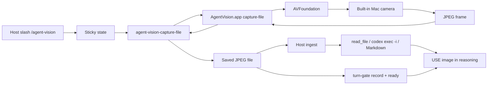

# Agent Vision

Agent Vision is a macOS-only local camera appliance for AI coding agents. A signed native app captures one JPEG frame when the agent needs to look; the host adapter (Codex or Grok Build) materializes that file and inspects it through a proven local path.

**Product purpose:** mood-first **sticky vision-in-the-loop**. Arm once with `/agent-vision` (default mood). While armed, every substantive turn **captures → understands the image → uses image content in reasoning** before responding. Disarm with `/agent-vision off`. New chat always starts **OFF**.

**Design:** signed local macOS camera capture only. Each look is a brief one-shot process (camera on, single JPEG frame, camera off). Frames stay on disk under the host frame directory. Install, idle, and disarmed turns leave the camera process stopped.

Agent Vision is for people who already trust a local assistant with real work and want continuous local visual context without screenshot gymnastics. The camera is an explicit, armable permission: opt in with `/agent-vision`, opt out with `/agent-vision off`.

## Hosts

| Host | Status | Features | Frames | Install |
| --- | --- | --- | --- | --- |
| **Codex** | Stable (package **1.5.0** + main sticky/HARD GATE) | sticky mood-first; snapshot, roast, mood; streaming disabled | `~/.codex/agent-vision/frames` | Packaged release + `install.sh` (reinstall skill for sticky) |
| **Grok Build** | Public (**1.5.0**+ main) | sticky mood-first; snapshot, roast, mood; streaming disabled | `~/.agent-vision/frames` | `install-runtime.sh` + `install-grok.sh` |

Both hosts share:

- Mood-first **sticky** sessions (arm → loop until off)
- **HARD GATE:** capture without using the image in reasoning is **INVALID**
- Per-turn **turn-gate** (`begin` / `record` / single-use `ready`)
- One-shot capture helper, signed `AgentVision.app`, no production MCP
- No camera process on install, idle, or disarmed turns

Grok uses multimodal `read_file`. Codex uses `codex exec -i` for mood/roast (Markdown path for snapshot).

Contracts: [docs/agent-vision-grok-session-sticky.md](docs/agent-vision-grok-session-sticky.md) · design history: [docs/agent-vision-grok-build-compatibility.md](docs/agent-vision-grok-build-compatibility.md).

## What It Does

Install, enable, and idle leave `agent-vision-mcp`, `AgentVision.app`, and every Agent Vision camera helper stopped. The camera runs only when the skill runs a capture for an armed turn or an explicit one-shot mode.

### Slash command

```text
/agent-vision              # arm sticky (default mood)
/agent-vision mood
/agent-vision snapshot
/agent-vision roast
/agent-vision status
/agent-vision off
/agent-vision streaming    # disabled; does not arm
```

| Mode | Behavior |
| --- | --- |
| **bare / mood** (primary) | Arm sticky → capture → understand → disposition → **use in reasoning** → respond (silent by default). Re-captures every non-whitelist turn until off. |
| **snapshot** / **roast** | Arm sticky + that mode (show image / playful roast), same HARD GATE loop on later turns. |
| **status** | Sticky + last-capture age; no camera if the turn is pure status. |
| **off** | Disarm; no further captures. Also: stop / disable / “turn off the camera”. |
| **streaming** | Disabled fixed message; does not arm. |

**HARD GATE (while armed):** on every turn except a closed skip whitelist (pure off, pure status, pure streaming):

```text
capture → understand image (pixels) → USE image content in reasoning → turn-gate ready → respond
```

Topic is irrelevant. Capture theater (save a JPEG and ignore it) is a failure. An answer identical to a blind answer is **INVALID**.

Helpers (never start the camera): `agent-vision-sticky`, `agent-vision-turn-gate`, `agent-vision-purge-frames` (PATH shims after install).

## Privacy and capture surface

What ships today:

- **Local-only capture** through signed `AgentVision.app` and AVFoundation on the built-in Mac camera.
- **One JPEG per look**, written under the host frame directory; snapshot and roast use that file as the user-visible image contract on both hosts.
- **Armed turns only** for automatic frame ingestion; pure status / off / streaming-disabled phrases leave the camera idle.
- **Per-frame analysis** for mood and roast on the current JPEG only (each capture stands alone).
- **Still-image appliance:** AVFoundation JPEG from the built-in Mac camera; local host frame directory as the contract.

## Who This Is For

Agent Vision is for local-first Codex or Grok Build users who want the assistant to keep visual context in the loop while they work—and to inspect physical things near the computer when it matters.

It is useful when the thing you need help with is real, visible, and annoying to describe:

- A handwritten note that says either `token` or `toker`, and unfortunately the distinction matters.
- A breadboard where one jumper wire is doing interpretive dance.
- A router light pattern that appears to be communicating in passive aggression.
- A whiteboard diagram that made sense during the meeting and has since become a corporate cave painting.
- A printed error code on a device whose manufacturer believed fonts were a moral weakness.
- A desk setup where the cable situation has entered its final form.
- A receipt, shipping label, part number, serial number, or sticker that you want to avoid retyping.
- A physical prototype where you need another set of eyes and those eyes can also read Swift.

Camera use stays deliberate: arm when you want vision in the loop; leave the skill off when you want a text-only session.

## Install

### Codex (stable package)

Ask Codex to install Agent Vision from the repository URL:

```text
Install Agent Vision from https://github.com/zfifteen/agent-vision
```

Codex should download the packaged release from that repository, extract it, run the package `install.sh`, and then open a new Codex session so `/agent-vision` is loaded.

For QA evidence that the install and uninstall lifecycle maps to the available OpenAI/Codex plugin guidance, see [docs/agent-vision-install-uninstall-traceability.md](docs/agent-vision-install-uninstall-traceability.md).

Manual package install:

```bash
curl -L -o agent-vision-1.5.0.tar.gz https://github.com/zfifteen/agent-vision/releases/download/v1.5.0/agent-vision-1.5.0.tar.gz
tar -xzf agent-vision-1.5.0.tar.gz
cd agent-vision-1.5.0
./install.sh
```

Sticky HARD GATE improvements ship on **main** after the 1.5.0 tarball. For those: install from a current clone (`scripts/install-local.sh`) or re-stage the latest `skills/camera-control` and helper scripts after pulling main.

### Grok Build

**Primary value is sticky mood-first vision** (continuous armed loop). One-shot snapshot and roast modes are available too. Image analysis uses multimodal `read_file` on the saved JPEG.

From the packaged release (or a clone with signed `dist/AgentVision.app`):

```bash
# 1) Shared runtime (signed app + capture helper + PATH shim)
scripts/install-runtime.sh

# 2) Grok skill (+ sticky / turn-gate / purge helpers + optional ~/.grok plugin tree)
scripts/install-grok.sh
```

Ensure `~/.local/bin` is on your `PATH` so `agent-vision-capture-file` and the helper shims resolve. Open a **new** Grok session with **sandbox off** (default), then:

```text
/agent-vision
```

or `/agent-vision mood`. That arms sticky vision for the conversation. Later substantive turns re-capture and use vision until `/agent-vision off`.

Frames: `~/.agent-vision/frames`. Uninstall: `scripts/uninstall-grok.sh` (adapter) and/or `scripts/uninstall-runtime.sh` (camera runtime).

See [INSTALL.md](INSTALL.md) and [docs/agent-vision-grok-install-uninstall-traceability.md](docs/agent-vision-grok-install-uninstall-traceability.md).

## Prompt Codex To Install This

If you are asking Codex to install the plugin for you, use a prompt like this:

```text
Install Agent Vision from https://github.com/zfifteen/agent-vision. Use the packaged release archive from the repo releases (the user-facing install path). Extract the archive, run ./install.sh, and open a new Codex session before using /agent-vision. Confirm install and idle Codex startup leave every Agent Vision process stopped.
```

## Slash Commands

Arm sticky mood (primary):

```text
/agent-vision
```

or `/agent-vision mood`.

Take one image and show it (also arms sticky):

```text
/agent-vision snapshot
```

Streaming mode is temporarily disabled:

```text
/agent-vision streaming
```

This launches no Agent Vision process. The command returns the temporary disabled message.

Stop / disarm:

```text
/agent-vision off
```

You can also say `stop streaming`, `turn off the camera`, or `agent vision off`. While disarmed (or if streaming was never started), Codex/Grok report that there is no streaming session and launch no Agent Vision process for pure disarm/streaming phrases.

Take one image and request immediate emotional damage, responsibly:

```text
/agent-vision roast
```

Roast mode uses the same camera lifecycle as snapshot mode, then adds a short text response. The roast is opt-in and based only on visible non-sensitive details such as outfit, posture, expression, lighting, or room chaos. Stay clear of protected traits, body size, age, disability, and other sensitive attributes. Keep it a tiny comedy mode with a short, playful punch.

## Example Workflows

Sticky mood while you work:

```text
/agent-vision

[then keep working — each substantive turn re-captures and uses vision]
```

Read something in the room:

```text
/agent-vision snapshot

What does the label on this device say?
```

Debug a physical setup:

```text
/agent-vision snapshot

Compare this prototype state to the expected wiring and tell me what looks wrong.
```

Use it as the least glamorous lab assistant ever hired:

```text
/agent-vision snapshot

Is this connector seated correctly, or am I about to spend 45 minutes blaming software for a cable problem?
```

Use it for desk archaeology:

```text
/agent-vision snapshot

Find the sticky note with the part number and read it back to me.
```

Use it for gentle accountability:

```text
/agent-vision snapshot

Does my whiteboard plan contain an actual architecture, or did I draw six boxes and hope confidence would do the rest?
```

Use it when you have made the bold choice to ask your computer for fashion notes:

```text
/agent-vision roast

Roast me in 400 characters or fewer.
```

The appliance reads a single local JPEG from the built-in camera path. Physical control of objects, pan/tilt, and alternate device selection are outside this surface. Reasoning is grounded in the returned frame only.

Estimate current interaction state for response delivery:

```text
/agent-vision mood
```

Mood mode is opt-in at arm time (and is the default for bare `/agent-vision`). It uses the same saved JPEG frame path as snapshot and roast, then analyzes that image for strict JSON (Codex via `codex exec -i`; Grok via `read_file`). The captured image and JSON are internal control signals and are not displayed in the normal response. Low-confidence or unusable images return `uncertain` or `absent` and do not apply state-specific response shaping. User correction overrides the visual estimate for the current response or task phase.

While sticky is armed, that mood (or scene) loop runs again on each substantive turn, including turns after the initial slash command.

## Architecture



| Layer | Location |
| --- | --- |
| Shared runtime | `AgentVision.app` + `agent-vision-capture-file` (Codex plugin cache and/or `~/.local/share/agent-vision`) |
| Session helpers | `agent-vision-sticky`, `agent-vision-turn-gate`, `agent-vision-purge-frames` |
| Session state | `~/.agent-vision/session-state.json`, `~/.agent-vision/turn-gate.json` |
| Codex host | `.codex-plugin/`, `commands/`, `skills/camera-control/` |
| Grok host | `hosts/grok/` skill + `plugin.json` |

The native app owns camera permission. Capture launches the signed app only for armed turns / explicit modes, writes one JPEG to an absolute path, and prints JSON. Host adapters never depend on production MCP image content for the user-visible contract.

**Codex package install** stages under `~/plugins/agent-vision` and `~/.codex/plugins/cache/local/agent-vision/1.5.0`, registers `agent-vision@local`, and removes legacy MCP config.

**Grok install** is two-step: shared runtime home + PATH shim, then skill under `~/.grok/skills/agent-vision` plus sticky/turn-gate/purge shims.

## Camera Modes

Snapshot mode:

1. Host runs `agent-vision-capture-file --output "$OUTPUT" --json`.
2. The file materializer launches `AgentVision.app capture-file`.
3. `AgentVision.app` starts the built-in camera if it is not already running.
4. The app waits for and returns one usable JPEG frame.
5. The file materializer writes the JPEG to `$OUTPUT` and prints JSON with `ok: true`.
6. Host displays or inspects the saved JPEG (Markdown and/or host vision path).

Roast mode:

1. Host runs `agent-vision-capture-file --output "$OUTPUT" --json`.
2. The file materializer writes one usable JPEG to `$OUTPUT`.
3. Host analyzes the image (Codex: `codex exec -i`; Grok: `read_file`).
4. Host returns the saved JPEG link and the roast text from that image analysis.

Mood mode (primary; also the sticky default):

1. Host runs `agent-vision-capture-file --output "$OUTPUT" --json`.
2. The file materializer writes one usable JPEG to `$OUTPUT`.
3. Host analyzes the image for strict JSON (Codex: `codex exec -i`; Grok: `read_file`).
4. Host applies permitted response-shape adjustments only to the current response or task phase.
5. Host does not display the captured image, raw JSON, confidence band, or visual-analysis rationale unless the user explicitly asks to debug mood mode.

**Sticky armed turns** repeat capture → understand → **use in reasoning** → turn-gate ready, with optional ambiguity burst (one second one-shot if the first frame is unusable).

Streaming is disabled on both hosts. `/agent-vision streaming` and pure stop-streaming phrases launch no Agent Vision process. Disarm phrases clear sticky and also launch no capture.

**Invariant:** armed substantive turns and explicit snapshot/roast/mood may blink the camera briefly; install, idle host startup, disarmed unrelated prompts, streaming, and stop-streaming create **no** Agent Vision process.

## Privacy

Explicit arm, per-look one-shot process, no production Agent Vision MCP server, no streaming session. macOS asks for camera permission for signed `AgentVision.app` on first capture. Repeated prompts usually mean the app identity changed—rerun the relevant installer.

See [PRIVACY.md](PRIVACY.md).

## Development

```bash
swift test
swift build -c release
scripts/install-local.sh --dry-run          # Codex source install checks
scripts/test-slash-commands.sh              # Codex slash matrix
scripts/test-grok-adapter.sh                # Grok static contracts (HARD GATE, sticky)
scripts/test-grok-sticky-state.sh           # sticky state helper
scripts/test-agent-vision-turn-gate.sh      # single-use ready
scripts/test-agent-vision-purge-frames.sh
AGENT_VISION_LIVE=1 scripts/test-capture-file-cli.sh   # optional live capture
scripts/install-runtime.sh --dry-run
scripts/install-grok.sh --dry-run
```

Build a Codex release archive:

```bash
AGENT_VISION_SIGN_IDENTITY="Developer ID Application: Your Name (TEAMID)" \
scripts/package-release.sh
```

Uninstall Codex local plugin: `scripts/uninstall-local.sh`.  
Uninstall Grok adapter / runtime: `scripts/uninstall-grok.sh`, `scripts/uninstall-runtime.sh`.

Source Codex install builds and signs locally (Swift, Xcode CLT, signing identity). Packaged Codex install is the default for end users. Grok currently installs from a repo tree that already contains a signed `dist/AgentVision.app`.

## Troubleshooting

**Codex — slash missing**

```bash
ls ~/.codex/plugins/cache/local/agent-vision/1.5.0
```

Open a new Codex session after install.

**Grok — slash missing or capture helper not found**

```bash
echo "$PATH" | tr ':' '\n' | grep local/bin
ls ~/.local/bin/agent-vision-capture-file
ls ~/.local/bin/agent-vision-sticky
ls ~/.local/share/agent-vision/dist/agent-vision-capture-file
ls ~/.grok/skills/agent-vision/SKILL.md
```

Re-run `scripts/install-runtime.sh` and `scripts/install-grok.sh`. Put `~/.local/bin` on `PATH`. Open a **new** Grok session. Use **sandbox off**.

**Camera permission loops** — rerun the installer that staged `AgentVision.app` (identity changed).

**Streaming** — disabled on both hosts; no process should start.

**Black frames** — warm-up retries (3 attempts, 5s apart), then error instead of a useless JPEG. Skills may try one ambiguity-burst second capture.

**Sticky “skips” vision** — reinstall skill from main; confirm HARD GATE + turn-gate in `SKILL.md`; open a new session; `/agent-vision status` should show sticky + last capture age.

## License

MIT
